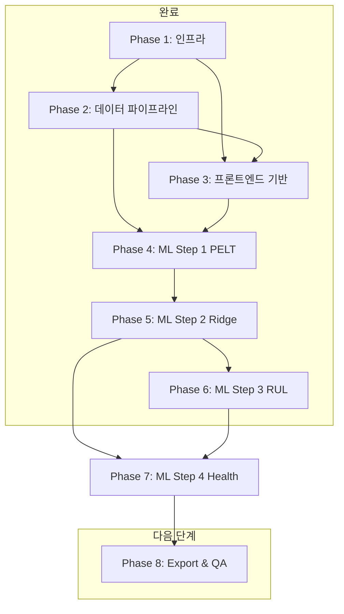

# ESP-PAS (ESP Performance Analysis System) 개발 로드맵

> **버전**: 4.1.0 | **최종 업데이트**: 2026-03-10 | **기준 PRD**: v2.0.0
> **전체 개발 기간**: 7일 (2026-03-03 ~ 2026-03-09)

---

## 개요

### 프로젝트 목적
Offshore ESP(Electric Submersible Pump)의 성능 저하를 자동 감지하고 잔여 수명(RUL)을 예측하는 웹 기반 분석 플랫폼. 엔지니어가 Excel 데이터를 업로드하면 3단계 ML 파이프라인이 자동으로 성능 진단(무차원 지수) → 건강 점수(GMM+Mahalanobis) → RUL 예측(Prophet) 순으로 수행된다.

> **v4.0 변경사항 (2026-03-06)**: 4-Step → 3-Step 파이프라인 재설계.
> - Step 1 (PELT 변화점 감지) 제거 → CV 자동 학습 구간 탐지로 대체
> - Step 1 승격: 4개 무차원 성능 지수 계산 (Affinity Laws 기반)
> - Step 2 신규: CV 자동 탐지 + GMM + Mahalanobis 건강 점수 0~100
> - Step 3 신규: Prophet 외삽, 임계치 40점 도달 시점 P10/P50/P90 예측
> - 상태 흐름: `no_data → data_ready → diagnosis_done → health_done → fully_analyzed`

### 전체 개발 기간
- **총 7일** (1인 풀스택 기준)
- Phase 1~2: 인프라 + 데이터 레이어
- Phase 3: 프론트엔드 기반 + 업로드 UI
- Phase 4~5: ML 파이프라인 (Step 1~2)
- Phase 6~7: ML 파이프라인 (Step 3~4)
- Phase 8: 통합, Export, 품질 검증

### 팀 구성 가정
- **1인 풀스택 개발자** (Backend + Frontend + DevOps 겸임)
- Python 백엔드 + Next.js 프론트엔드 경험 보유
- ML 라이브러리(ruptures, scikit-learn) 기본 이해 필요

### 핵심 기술 스택
| 레이어 | 기술 | 버전 |
|--------|------|------|
| Frontend | Next.js + React + TypeScript | **16.1** / **19.2.4** / 5.x |
| 스타일링 | Tailwind CSS + shadcn/ui | **4.2.x** |
| 차트 | react-plotly.js + plotly.js | **2.6.0** / **3.1.0** |
| 상태 관리 | Zustand + TanStack Query | **5.0.11** / **5.90.21** |
| Backend | FastAPI + SQLAlchemy + asyncpg | **0.135.1** / **2.0.48** / **0.31.0** |
| Pydantic | pydantic + pydantic-settings | **2.12.5** / **2.13.1** |
| ML | ruptures + scikit-learn + lifelines | **1.1.10** / **1.8.0** / **0.30.1** |
| 비동기 | Celery + redis-py | **5.6.2** / **7.1.1** |
| DB | TimescaleDB (PostgreSQL **16** 확장) | **2.23** |
| 컨테이너 | Docker Compose | |

---

## MVP 범위

### MVP 포함 기능

| ID | 기능명 | 우선순위 | 관련 PRD |
|----|--------|----------|----------|
| F-001 | Excel 데이터 업로드 (파싱 + Well 정규화 + DB 적재) | P0 | §3, §5 |
| F-002 | Well 대시보드 (카드 그리드, 건강 점수, 상태 배지) | P0 | §3 |
| F-003 | 시계열 성능 차트 (다중 파라미터, 날짜 범위 선택) | P0 | §3 |
| F-004 | Step 1 — PELT 변화점 감지 + 베이스라인 구간 확정 | P1 | §4 |
| F-005 | Step 2 — Ridge 회귀 잔차 분석 + 저하율 정량화 | P1 | §4 |
| F-006 | Step 3 — Wiener 프로세스 Bootstrap RUL 예측 | P1 | §4 |
| F-007 | Step 4 — GMM + 마할라노비스 건강 점수 산출 | P1 | §4 |
| F-008 | 워크플로우 순차 잠금 (Step 1→2→3→4 순서 강제) | P1 | §4, §5 |
| F-009 | CSV Export (원본 + 잔차 + 건강 점수 통합) | P2 | §3 |

### MVP 제외 기능

| 제외 항목 | 제외 이유 | 향후 Phase |
|-----------|-----------|------------|
| 인증(Auth) / 사용자 관리 | 단일 사용자 로컬 환경 가정, 복잡도 대비 MVP 가치 낮음 | Phase 2 |
| 다중 Well 동시 분석 | 단일 Well 파이프라인 검증 후 확장 필요 | Phase 2 |
| 실시간 데이터 스트리밍 | WebSocket 인프라 추가 필요, MVP 범위 초과 | Phase 3 |
| PDF Export | 레이아웃 엔진 추가 필요, CSV로 대체 가능 | Phase 2 |
| BOCPD 알고리즘 | PELT로 충분한 MVP 요구사항 충족 | Phase 2 |
| LSTM 모델 | Wiener 프로세스로 충분, GPU 인프라 불필요 | Phase 3 |
| 자동 알람 발송 | 이메일/SMS 연동 인프라 필요 | Phase 2 |
| 모바일 반응형 UI | 1280px+ 데스크톱 최적화로 충분 | Phase 2 |

---

## 단계별 계획

### ✅ Phase 1: 인프라 & 개발 환경 (Infrastructure)

**목표**: 전체 개발 환경을 Docker Compose로 단일 명령으로 구동 가능하게 하고, TimescaleDB 스키마와 초기화 SQL을 완성한다.

**산출물**:
- 실행 가능한 `docker-compose.yml` (timescaledb, redis, backend, celery_worker, frontend 5개 서비스)
- TimescaleDB hypertable 포함 초기화 SQL (`backend/app/db/init.sql`)
- FastAPI 앱 골격 (`backend/app/main.py`)
- Alembic 마이그레이션 초기 설정
- `backend/requirements.txt` 완성

#### 태스크

- [x] **[INFRA-1] 모노레포 디렉토리 구조 생성** `Backend/DevOps` ~30분
  - 아래 경로를 모두 생성 (파일 없이 디렉토리만)
  ```
  backend/app/api/
  backend/app/models/
  backend/app/schemas/
  backend/app/services/
  backend/app/worker/
  backend/app/db/
  backend/tests/
  backend/alembic/
  frontend/app/wells/[id]/
  frontend/components/charts/
  frontend/components/ui/
  frontend/lib/
  frontend/hooks/
  docs/
  ```

- [x] **[INFRA-2] docker-compose.yml 작성** `DevOps` ~45분
  - 서비스 5개: `timescaledb`, `redis`, `backend`, `celery_worker`, `frontend`
  - `timescaledb`: `timescale/timescaledb:latest-pg16`, 포트 5432, 볼륨 `pgdata`
  - `redis`: `redis:7-alpine`, 포트 6379, `--appendonly yes` (영속화 필수 — Celery 작업 유실 방지)
  - `backend`: Python 3.11 슬림 이미지, 포트 8000, `backend/` 볼륨 마운트, `--reload`
  - `celery_worker`: backend와 동일 이미지, `celery -A app.worker.celery_app worker`
  - `frontend`: Node 20 alpine, 포트 3000, `frontend/` 볼륨 마운트
  - 환경 변수: `DATABASE_URL`, `REDIS_URL`, `CELERY_BROKER_URL` `.env` 파일로 분리
  - `depends_on` 설정: backend/celery_worker → timescaledb, redis

- [x] **[INFRA-3] backend/requirements.txt 작성** `Backend` ~20분
  ```
  fastapi[standard]==0.135.1
  uvicorn[standard]
  sqlalchemy[asyncio]==2.0.48
  asyncpg==0.31.0
  alembic
  pydantic==2.12.5
  pydantic-settings==2.13.1
  celery[redis]==5.6.2
  redis==7.1.1
  pandas
  openpyxl
  ruptures==1.1.10
  scikit-learn==1.8.0
  lifelines==0.30.1
  numpy
  python-multipart   # 파일 업로드 필수
  ```

- [x] **[INFRA-4] TimescaleDB 초기화 SQL 작성** `Backend` ~60분
  - 파일 위치: `backend/app/db/init.sql`
  - `wells` 테이블: `id(UUID PK)`, `name(VARCHAR UNIQUE)`, `field`, `latest_health_score`, `analysis_status(VARCHAR DEFAULT 'no_data')`, `created_at`, `updated_at`
  - `esp_daily_data` 테이블: `well_id(FK)`, `date(DATE NOT NULL)`, `vfd_freq`, `motor_volts`, `motor_current`, `motor_power`, `motor_temp`, `motor_vib`, `current_leak`, `pi`, `ti`, `pd`, `dd`, `whp`, `casing_pressure`, `water_cut`, `liquid_rate`, `water_rate`, `oil_haimo`, `gas_meter`, `gor`, `dp_cross_pump`, `liquid_pi`, `oil_pi`, `choke`, `flt`
  - **`SELECT create_hypertable('esp_daily_data', 'date');`** — hypertable 생성 필수
  - `analysis_sessions` 테이블: `id(UUID PK)`, `well_id(FK)`, `step_number(INT)`, `status(VARCHAR)`, `parameters(JSONB)`, `celery_task_id(VARCHAR)`, `error_message(TEXT)`, `created_at`, `updated_at`
  - `baseline_periods` 테이블: `id`, `well_id(FK)`, `start_date`, `end_date`, `changepoints(JSONB)`, `is_manually_set(BOOL)`
  - `residual_data` 테이블: `well_id`, `date`, `predicted`, `actual`, `residual`, `residual_ma30`, `degradation_rate`
  - `rul_predictions` 테이블: `well_id`, `predicted_at`, `rul_median`, `rul_p10`, `rul_p90`, `expected_failure_date`, `wiener_drift`, `wiener_diffusion`
  - `health_scores` 테이블: `well_id`, `date`, `mahalanobis_distance`, `health_score`, `health_status(VARCHAR)` — `CHECK health_status IN ('Normal','Degrading','Critical')`
  - Docker entrypoint에서 자동 실행되도록 Dockerfile에서 참조

- [x] **[INFRA-5] SQLAlchemy ORM 모델 작성** `Backend` ~45분
  - 파일 위치: `backend/app/models/` 하위 각 엔티티별 파일
  - `backend/app/models/well.py`: `Well` 모델 (analysis_status Enum 포함)
  - `backend/app/models/esp_data.py`: `EspDailyData` 모델
  - `backend/app/models/analysis.py`: `AnalysisSession`, `BaselinePeriod`, `ResidualData`, `RulPrediction`, `HealthScore` 모델
  - `backend/app/db/database.py`: `async_engine`, `AsyncSessionLocal`, `get_db` 의존성 함수
  - `analysis_status` 상태값을 Python Enum으로 정의: `no_data`, `data_ready`, `baseline_set`, `residual_done`, `rul_done`, `fully_analyzed`

- [x] **[INFRA-6] FastAPI 앱 골격 + Alembic 초기화** `Backend` ~30분
  - `backend/app/main.py`: FastAPI 인스턴스, CORS 미들웨어(localhost:3000 허용), 라우터 include 준비
  - `backend/app/core/config.py`: pydantic-settings로 환경 변수 관리 (`DATABASE_URL`, `REDIS_URL`, `CELERY_BROKER_URL`)
  - Alembic 초기화: `alembic init alembic`, `env.py`에 SQLAlchemy 비동기 엔진 설정
  - 초기 마이그레이션 생성: `alembic revision --autogenerate -m "init"`

**완료 기준 (DoD)**:
- `docker compose up -d` 실행 후 모든 컨테이너가 `healthy` 상태
- `curl http://localhost:8000/docs` 응답으로 FastAPI Swagger UI 접근 가능
- `curl http://localhost:8000/health` → `{"status": "ok"}` 반환
- TimescaleDB에 모든 테이블 + hypertable 생성 확인 (`\dt` 명령)

---

### ✅ Phase 2: 데이터 파이프라인 (Data Pipeline)

**목표**: Excel 파일을 업로드하면 자동으로 Well이 생성되고 `esp_daily_data`에 모든 레코드가 적재되는 API를 완성한다.

**산출물**:
- `POST /api/upload` — Excel 파싱 + Well 정규화 + DB 적재 완성
- `GET /api/wells`, `GET /api/wells/{id}` — Well 목록/상세 API
- `GET /api/wells/{id}/data` — 날짜 범위별 시계열 조회 API
- Pydantic 스키마 완성
- Celery 앱 초기화

#### 태스크

- [x] **[API-1] Pydantic 스키마 정의** `Backend` ~40분
  - 파일 위치: `backend/app/schemas/`
  - `well.py`: `WellResponse(id, name, field, latest_health_score, analysis_status, data_count, date_range)`, `WellListResponse`
  - `esp_data.py`: `EspDataPoint(date, vfd_freq, motor_current, motor_temp, motor_vib, pi, pd, ...)`, `EspDataResponse(well_id, data, total_count)`
  - `upload.py`: `UploadResponse(well_id, well_name, records_inserted, date_range, columns_found, warnings)`
  - `analysis.py`: `AnalysisStatusResponse(status, session_id, task_id)`

- [x] **[API-2] Excel 파싱 서비스 구현** `Backend` ~90분
  - 파일 위치: `backend/app/services/upload_service.py`
  - `pandas.read_excel()` 로 데이터 로드 (openpyxl 엔진)
  - **Well 이름 정규화 함수** 필수: `normalize_well_name()` — 정규식으로 `LF12-3A1H` → `LF12-3-A1H` 형태 교정 (숫자-영문 사이 하이픈 삽입)
  - 컬럼 매핑 딕셔너리를 별도 상수로 분리: `COLUMN_MAPPING = {"VFD Freq": "vfd_freq", ...}` — 컬럼명 변경에 대응
  - **Null 처리 전략**: `liquid_rate`, `water_rate`, `oil_haimo`, `gas_meter` 컬럼은 NaN을 `None`으로 변환 (DB에 NULL 저장)
  - `date` 컬럼 파싱: `pd.to_datetime()` 후 `.date()` 변환, 중복 날짜 감지 시 마지막 값 우선
  - 유효성 검증: 필수 컬럼(`date`, `vfd_freq`, `pi`, `motor_current`) 존재 여부 확인, 누락 시 400 에러
  - 반환값: `(well_name, DataFrame)` — 상위 레이어에서 DB 적재 담당

- [x] **[API-3] 업로드 API 라우터 구현** `Backend` ~60분
  - 파일 위치: `backend/app/api/upload.py`
  - `POST /api/upload`: `UploadFile` 수신 (최대 50MB — FastAPI `max_upload_size` 설정)
  - 파일 확장자 검증: `.xlsx`, `.xls`만 허용
  - 트랜잭션 처리: Well upsert → esp_daily_data bulk insert (SQLAlchemy `execute(insert(...))` 배치)
  - Well 중복 처리: `INSERT ... ON CONFLICT (name) DO UPDATE SET updated_at = now()`
  - `analysis_status`를 `data_ready`로 업데이트
  - 오류 발생 시 롤백 + 상세 오류 메시지 반환 (어떤 컬럼이 문제인지 명시)
  - 성공 시 `UploadResponse` 반환 (삽입 건수, 날짜 범위, 경고 메시지 포함)

- [x] **[API-4] Well 관리 API 라우터 구현** `Backend` ~45분
  - 파일 위치: `backend/app/api/wells.py`
  - `GET /api/wells`: 전체 Well 목록 (최신 건강 점수, 상태, 데이터 건수 포함)
  - `GET /api/wells/{well_id}`: 단일 Well 상세 (데이터 범위, 현재 분석 상태 포함)
  - `GET /api/wells/{well_id}/data`: 날짜 범위 파라미터 (`start_date`, `end_date`, `columns` 쿼리 파라미터)
    - `columns` 미지정 시 전체 컬럼 반환
    - TimescaleDB 날짜 인덱스 활용 (`WHERE date BETWEEN :start AND :end`)
    - 최대 반환 행 수 제한: 3000행 (차트 렌더링 성능)

- [x] **[API-5] Celery 앱 초기화** `Backend` ~30분
  - 파일 위치: `backend/app/worker/celery_app.py`
  - Celery 인스턴스 생성: `broker=REDIS_URL`, `backend=REDIS_URL`
  - `task_serializer='json'`, `result_serializer='json'`, `task_track_started=True`
  - **Redis 영속화 확인**: `redis.conf`에 `appendonly yes` 설정 (docker-compose.yml에서 커맨드로 전달)
  - `GET /api/tasks/{task_id}` 라우터: Celery `AsyncResult`로 상태 조회 (`PENDING`, `STARTED`, `SUCCESS`, `FAILURE`)

- [x] **[API-6] API 통합 테스트 작성** `Backend` ~40분
  - 파일 위치: `backend/tests/test_upload.py`
  - 11개 테스트 / 4개 클래스: TestUploadSuccess, TestUploadValidation, TestWellNameNormalization, TestUploadIdempotency
  - 테스트 항목: 정상 업로드, 컬럼 누락 오류, Well 이름 정규화 검증, 중복 업로드(덮어쓰기)
  - `pytest-asyncio` + `httpx.AsyncClient` + session-scoped event loop 사용 (11/11 통과)

**완료 기준 (DoD)**:
- `curl -X POST http://localhost:8000/api/upload -F "file=@Production\ Data.xlsx"` 성공
- DB에 `wells` 1건, `esp_daily_data` 464건 적재 확인
- `GET /api/wells` 응답에 `LF12-3-A1H` (정규화된 이름) 포함
- `GET /api/wells/{id}/data?start_date=2023-09-22&end_date=2023-12-31` 정상 응답
- 모든 단위 테스트 통과 (`pytest tests/test_upload.py -v`)

---

### ✅ Phase 3: 프론트엔드 기반 (Frontend Foundation)

**목표**: Next.js 프로젝트를 초기화하고, Well 대시보드(SCR-001)와 파일 업로드 화면(SCR-002), 공통 레이아웃 및 시계열 차트를 완성한다. Day 2에서 Step 1~4 분석 페이지 골격, 워크플로우 가드, Celery 폴링 훅까지 완성.

**산출물**:
- Next.js 16 프로젝트 초기화 + shadcn/ui 설정
- `frontend/lib/api.ts` — API 클라이언트 (Step 1~4 타입 및 함수 포함)
- `frontend/lib/workflow.ts` — 워크플로우 상태 유틸 (`STATUS_ORDER`, `canRunStep`, `isStepComplete`)
- `frontend/lib/store.ts` — Zustand 스토어 (Well + 분석 작업 상태)
- `frontend/hooks/useTaskPolling.ts` — Celery 2초 폴링 훅
- `frontend/hooks/useAnalysis.ts` — Step별 실행/조회 TanStack Query 훅
- `frontend/components/analysis/` — StatusBadge, WorkflowGuard, AnalysisRunButton 공통 컴포넌트
- `frontend/app/wells/[id]/layout.tsx` — Well 공통 레이아웃 (헤더 + 탭 네비게이션)
- `frontend/app/wells/[id]/step/1~3/page.tsx` — Step 1~3 분석 페이지
- `frontend/app/analysis/step4/page.tsx` — Step 4 종합 건강점수 페이지
- SCR-001: Well 대시보드 (Step 진행 Progress bar 포함)
- SCR-002: 파일 업로드
- SCR-003: Well 상세 (시계열 차트)
- 4개 Plotly 차트 컴포넌트

#### 태스크

- [x] **[FE-1] Next.js 프로젝트 초기화 + 패키지 설치** `Frontend` ~30분
  - `npx create-next-app@latest frontend --typescript --tailwind --app --no-src-dir`
  - 추가 패키지 설치:
    ```bash
    npm install zustand @tanstack/react-query react-plotly.js plotly.js
    npm install @tanstack/react-query-devtools
    npm install -D @types/plotly.js
    npx shadcn@latest init
    npx shadcn@latest add card badge button progress table skeleton toast
    ```
  - `tailwind.config.ts`에 `darkMode: 'class'` 추가 (다크모드 준비)
  - `next.config.ts`에 백엔드 API proxy 설정: `/api/*` → `http://backend:8000/api/*` (Docker 네트워크 내 통신)

- [x] **[FE-2] API 클라이언트 구현 (Step 1~4 포함)** `Frontend` ~40분
  - 파일 위치: `frontend/lib/api.ts`
  - 기본 fetch 래퍼: `apiFetch(path, options)` — 서버/클라이언트 환경별 BASE_URL 분기 처리 (SSR 404 오류 수정)
  - 에러 처리: HTTP 4xx/5xx를 `ApiError` 클래스로 변환 (status code + message)
  - Well API: `getWells()`, `getWell(id)`, `getWellData(id, params)`, `uploadFile(file)`
  - 분석 API 타입: `TaskStatusResponse`, `Step1Response`, `Step2Response`, `Step3Response`, `Step4Response`, `Step4AllResponse`
  - 분석 API 함수: `getTaskStatus(taskId)`, `runStep1~4()`, `getStep1~4Result()`, `exportCsv(wellId)`

- [x] **[FE-3] Zustand 스토어 구현** `Frontend` ~30분
  - 파일 위치: `frontend/lib/store.ts`
  - `useWellStore`: `selectedWellId`, `setSelectedWellId`
  - `useAnalysisStore`: `activeTaskIds: Record<string,string>`, `setTaskId(wellId, step, taskId)`, `clearTaskId(wellId, step)`, `getTaskId(wellId, step)`
  - 스토어 간 의존성 없이 독립적으로 유지 (서버 상태는 TanStack Query로 관리)

- [x] **[FE-4] TanStack Query 훅 구현** `Frontend` ~40분
  - `hooks/useWells.ts`: `useQuery(['wells'])` — 60초 staleTime
  - `hooks/useWell.ts`: `useQuery(['well', id])`
  - `hooks/useWellData.ts`: `useQuery(['wellData', id, params])` — 날짜 범위 파라미터 포함
  - `hooks/useTaskPolling.ts`: `useQuery(['task', taskId], { refetchInterval: 2000 })` — `SUCCESS`/`FAILURE` 시 폴링 자동 중단
  - `hooks/useAnalysis.ts`: `useRunStep(wellId, step)` useMutation, `useStepResult(wellId, step, enabled)` useQuery, `useRunStep4()`, `useStep4Result(enabled)`

- [x] **[FE-5] 공통 레이아웃 구현** `Frontend` ~60분
  - `frontend/app/layout.tsx`: TanStack Query Provider + Zustand 설정, `<Sidebar> | <main>` 구조
  - `Sidebar.tsx`: 로고, Well 목록, 대시보드/업로드/Step4 종합분석 네비게이션
  - `components/analysis/StatusBadge.tsx`: 분석 상태별 shadcn/ui Badge (6가지 상태)
  - `components/analysis/WorkflowGuard.tsx`: Step 실행 가능 여부 가드, 불가 시 이전 Step 링크 + 안내 메시지
  - `components/analysis/AnalysisRunButton.tsx`: 실행 버튼 + Celery 폴링 + 완료/에러 피드백 통합

- [x] **[FE-6] SCR-001 Well 대시보드 구현** `Frontend` ~60분
  - 파일 위치: `frontend/app/page.tsx`
  - 상단 집계 지표 카드 3개: 전체 Well 수, 정상 Well 수(건강점수 ≥70), 위험 Well 수(<40)
  - Well 카드 그리드 (2~4열): 각 카드에 Well 이름, 건강 점수 게이지, StatusBadge, 최근 측정 날짜
  - **Step 1~3 진행 Progress bar**: 3단계 세그먼트 바 — 각 Step 완료 시 색상 변경
  - **분석 현황 배너**: Step3 완료 Well 수 / 전체 Well 수 통계 + Step4 바로가기 링크
  - 카드 클릭 → `/wells/[id]` 이동
  - `useWells` 훅 연결, 30초 자동 갱신(`refetchInterval: 30000`)

- [x] **[FE-7] SCR-002 파일 업로드 UI 구현** `Frontend` ~75분
  - 파일 위치: `frontend/app/upload/page.tsx`
  - 드래그앤드롭 영역: 네이티브 drag event 처리
  - 파일 선택 시: 파일명, 크기, 확장자 미리보기
  - 업로드 결과 화면: 삽입 건수, 날짜 범위, Well 이름 표시
  - 오류 화면: HTTP 에러 메시지 + 재시도 버튼
  - 완료 후 `router.push('/')` 또는 해당 Well 상세로 이동

- [x] **[CHART-1] Plotly.js 시계열 차트 컴포넌트 구현** `Frontend` ~90분
  - 파일 위치: `frontend/components/charts/` (MultiPlotPanel, SinglePlot)
  - `react-plotly.js`의 `Plot` 컴포넌트 래핑
  - 다중 Y축, 변화점 어노테이션, `hovermode: 'x unified'`, 줌/팬, rangeslider
  - **SSR 비활성화 필수**: `dynamic(import('react-plotly.js'), { ssr: false })` — Next.js 16 Turbopack 환경

- [x] **[CHART-2] 컬럼 선택 체크박스 UI 구현** `Frontend` ~30분
  - 파일 위치: `frontend/components/charts/PlotColumnSelector.tsx`
  - 컬럼 그룹화: 전기계통 / 압력계통 / 생산량
  - 기본 선택: `vfd_freq`, `motor_current`, `pi`, `pd` (4개)

- [x] **[SCR-003] Well 상세 페이지 구현** `Frontend` ~60분
  - `frontend/app/wells/[id]/layout.tsx` (서버 컴포넌트): Well fetch, notFound() 처리, WellTabs 서브컴포넌트
  - `_components/WellTabs.tsx` (클라이언트): usePathname 활성 탭 감지, Step 탭 네비게이션, canRunStep 잠금 상태
  - `frontend/app/wells/[id]/page.tsx`: DateRangePicker + MultiPlotPanel + 시계열 차트
  - `loading.tsx`, `error.tsx` 각각 생성

- [x] **[SCR-004~006] Step 1~3 분석 페이지 구현** `Frontend` ~75분
  - `frontend/app/wells/[id]/step/1/page.tsx`: WorkflowGuard(requiredStep=1), AnalysisRunButton, PELT 변화점 Plotly 차트(수직선 어노테이션 + 베이스라인 음영) + 변화점 날짜 테이블
  - `frontend/app/wells/[id]/step/2/page.tsx`: WorkflowGuard(requiredStep=2), 잔차 막대차트 + y=0 기준선 + TrendIndicator 카드
  - `frontend/app/wells/[id]/step/3/page.tsx`: WorkflowGuard(requiredStep=3), P10/P50/P90 팬 차트 + RUL 요약 카드 3개
  - 각 Step별 `loading.tsx`, `error.tsx`('use client') 생성

- [x] **[SCR-007] Step 4 종합 건강점수 페이지 구현** `Frontend` ~60분
  - `frontend/app/analysis/step4/page.tsx` (글로벌 페이지)
  - Well 목록 기반 rul_done 이상 카운트/배너 (전체 Well Step3 완료 필요 안내)
  - Step4 실행 버튼 + Celery 폴링 상태 표시
  - 결과 테이블: Well별 건강점수/마할라노비스 거리/클러스터
  - 수평 바 차트: 건강점수 0~100 (색상 조건부 렌더링)
  - `loading.tsx`, `error.tsx`('use client') 생성

**완료 기준 (DoD)**:
- `http://localhost:3000` 접속 시 Well 대시보드 렌더링 (데이터 없을 때 Empty State 표시)
- `/upload`에서 `Production Data.xlsx` 드래그앤드롭 업로드 성공
- 업로드 후 대시보드에 `LF12-3-A1H` Well 카드 + Step Progress bar 표시
- 사이드바에서 Well 클릭 시 `/wells/[id]`로 정상 라우팅
- Well 상세 페이지에서 시계열 차트 정상 렌더링 (464개 데이터 포인트)
- Step 1~3 페이지 접근 시 WorkflowGuard 정상 동작 (이전 Step 미완료 시 잠금 UI)
- Step 4 페이지 접근 시 전체 Well 상태 요약 표시

---

### ✅ Phase 4: ML Step 1 — 성능 진단 (Performance Diagnosis)

> **v4.0 재설계**: PELT 변화점 감지 제거. 4개 무차원 성능 지수를 전체 기간에 걸쳐 계산한다.

**목표**: Affinity Laws 기반 4개 무차원 지수(Cp, ψ, V_std, T_eff)를 전체 기간에 계산하고, 30일 이동 평균과 함께 DB에 저장한다.

**산출물**:
- `backend/app/services/step1_diagnosis.py` — 4개 무차원 지수 계산
- `POST/GET /api/wells/{id}/analysis/step1` API + Celery 태스크
- `frontend/app/wells/[id]/step/1/page.tsx` — 4개 지수 2×2 서브플롯 차트

#### 태스크

- [x] **[ML-1] Step 1 무차원 지수 서비스 구현** `Backend` ~60분
  - 파일 위치: `backend/app/services/step1_diagnosis.py`
  - `compute_sg_liquid()`, `compute_dimensionless_indices()`, `run_step1_analysis()`, `get_step1_result()`
  - 베이스라인 의존성 없음 — 전체 기간 일괄 계산
  - 30일 이동 평균 (min_periods=1, 초기 기간도 계산)
  - 상태 → `diagnosis_done`

- [x] **[ML-2] Step 1 Celery 태스크 + API 라우터** `Backend` ~45분
  - `task_run_step1(well_id, sg_oil, sg_water)`: Celery 태스크
  - `POST /api/wells/{id}/analysis/step1`: sg_oil/sg_water 파라미터 (기본값 0.85/1.03)
  - `GET /api/wells/{id}/analysis/step1`: `residual_data` 테이블에서 4개 지수 반환

- [x] **[ML-5] Step 1 단위 테스트 작성** `Backend` ~40분
  - 파일 위치: `backend/tests/test_step2.py` (파일명 유지)
  - 테스트 항목: Cp/ψ 수식 검증, vfd_freq=0 NaN 처리, motor_power=0 NaN 처리
  - 통합 테스트: MA30 저장, 행 수 검증, status=diagnosis_done 확인

- [x] **[FE-STEP1] Step 1 sg 파라미터 입력 + 4개 지수 차트 구현** `Frontend` ~45분
  - sg_oil/sg_water 입력 필드 + 실행 버튼
  - `IndicesSubplotChart`: 4개 지수를 2×2 서브플롯으로 표시 (원시 + MA30 중첩)
  - `EtaProxyChart`: η_proxy 보조 차트

**완료 기준 (DoD)**:
- Step 1 실행 후 `residual_data`에 4개 지수 + MA30 저장 확인
- `analysis_status`가 `diagnosis_done`으로 업데이트
- 4개 지수 차트 정상 렌더링 확인

---

### ✅ Phase 5: ML Step 2 — 건강 점수 (Health Scoring)

> **v4.0 재설계**: Ridge 잔차 분석 제거. CV 자동 학습 구간 탐지 + GMM + Mahalanobis 건강 점수로 대체.

**목표**: 4개 무차원 지수에 로그 변환 후 7일 롤링 CV로 학습 구간을 자동 탐지하고, GMM + Mahalanobis 거리로 건강 점수 0~100을 산출한다.

**산출물**:
- `backend/app/services/step2_health.py` — CV 탐지 + GMM + 건강 점수
- `POST/GET /api/wells/{id}/analysis/step2` API + Celery 태스크
- `frontend/app/wells/[id]/step/2/page.tsx` — 건강 점수 시계열 + Mahalanobis 차트

#### 태스크

- [x] **[ML-3] Step 2 건강 점수 서비스 구현** `Backend` ~120분
  - 파일 위치: `backend/app/services/step2_health.py`
  - `detect_training_period()`: 7일 롤링 CV, 폴백 우선순위 Power+Head(5%) > +Vibration(10%) > +Cooling(10%), 최소 60일 연속
  - `GaussianMixture(n_components=2, n_init=10, random_state=42)` 학습
  - 건강 점수: `100 × exp(-k × distance)`, k = ln(2) / p75_baseline_distance
  - 상태 분류: ≥70 Normal, 40~70 Degrading, <40 Critical
  - 상태 → `health_done`

- [x] **[ML-4] Step 2 Celery 태스크 + API 라우터** `Backend` ~45분
  - `task_run_step2(well_id)`: Celery 태스크 (파라미터 없음)
  - 요구 상태: `diagnosis_done`
  - `GET /api/wells/{id}/analysis/step2`: 건강 점수 시계열 + 학습 구간 날짜 반환

- [x] **[FE-STEP2] Step 2 건강 점수 차트 구현** `Frontend` ~45분
  - `HealthScoreChart`: 70/40 임계선 + 학습 구간 파란 배경
  - `MahalanobisChart`: 정상 클러스터로부터의 통계적 거리
  - 요약 카드 3개: 현재 점수, 학습 구간, 상태별 일수

**완료 기준 (DoD)**:
- Step 2 실행 후 `health_scores` 테이블에 전체 기간 저장 확인
- `baseline_periods` 테이블에 CV 자동 탐지 학습 구간 저장 확인
- `analysis_status`가 `health_done`으로 업데이트
- 건강 점수 차트에 70/40 임계선 표시 확인

---

### ✅ Phase 6: ML Step 3 — 3-Pillar 고장 모드 알람 (Fault Mode Alarm)

> **v5.0 재설계 (2026-03-08)**: OLS+PI 기반 RUL 수치 예측 → 3-Pillar 독립 알람 프레임워크로 전환.
> 예지 날짜 대신 "지금 이 지표가 위험한가?" 직접 판정. 통합 점수 없이 각 고장 모드 독립 판정.

**목표**: ψ_ma30(유압), v_std_ma30(기계), current_leak(전기) 3개 지표를 독립적으로 평가하여 NORMAL/WARNING/CRITICAL 알람을 산출하고 시계열 차트와 함께 표시한다.

**산출물**:
- `backend/app/services/step3_rul.py` — 3-Pillar Mann-Kendall + 절대값 알람
- `backend/app/models/analysis.py` — `PillarResult` ORM 모델
- `backend/alembic/versions/008_add_pillar_results.py` — pillar_results 마이그레이션
- `POST/GET /api/wells/{id}/analysis/step3` API + Celery 태스크
- `frontend/app/wells/[id]/step/3/page.tsx` — 3-Pillar 알람 패널 + 시계열 차트

#### 태스크

- [x] **[ML-6] Step 3 3-Pillar 알람 서비스 구현** `Backend`
  - 파일 위치: `backend/app/services/step3_rul.py`
  - P1 (Hydraulic): `psi_ma30` Mann-Kendall 하락 추세 + baseline×0.80 CRITICAL 임계치
  - P2 (Mechanical): `v_std_ma30` Mann-Kendall 상승 추세 + baseline×1.50 CRITICAL 임계치
  - P3 (Electrical): `current_leak` 7일 이동 중앙값 + 3일 연속 100/1000μA 초과 판정
  - Mann-Kendall 순수 Python 구현 (외부 의존성 없음)
  - `pillar_results` 테이블 DELETE→INSERT (Well당 최신 1건 유지)
  - 상태 → `fully_analyzed`

- [x] **[ML-7] Step 3 Celery 태스크 + API** `Backend`
  - `task_run_step3(well_id)`: Celery 태스크 (파라미터 없음)
  - 요구 상태: `health_done`
  - `GET /api/wells/{id}/analysis/step3`: `Step3PillarResponse` 반환

- [x] **[FE-STEP3] Step 3 3-Pillar 알람 UI 구현** `Frontend`
  - 전체 요약 배너: 최악 Pillar 기준 CRITICAL/WARNING/NORMAL 표시
  - P1/P2 패널: Mann-Kendall τ, p-value, 현재값/임계치 + ψ_ma30/v_std_ma30 시계열 차트
  - P3 패널: 누설 전류값, 연속 초과 일수 + current_leak 시계열 차트 (100/1000μA 기준선)
  - 배지 색상: CRITICAL=빨강, WARNING=주황, NORMAL=초록, UNKNOWN=회색

**완료 기준 (DoD)**:
- Step 3 실행 후 `pillar_results` 테이블에 P1/P2/P3 알람 저장 확인
- `analysis_status`가 `fully_analyzed`로 업데이트
- 3-Pillar 패널 + 시계열 차트 정상 렌더링 확인

---

### ~~Phase 7: ML Step 4 — 별도 건강 점수 (제거됨)~~

> **v4.0 변경사항**: Phase 7 제거. 건강 점수 기능이 Phase 5 (Step 2)로 통합됨.
> GMM + Mahalanobis는 이제 Step 2의 핵심 알고리즘이며, 3-Step 파이프라인으로 완성됨.

---

### 🔄 Phase 8: Export & QA (Integration & Quality Assurance)

**목표**: CSV Export(F-009) 구현, 전체 워크플로우 E2E 통합 테스트, PRD 비기능 요구사항 검증, 버그 수정 및 코드 정리.

**산출물**:
- `GET /api/wells/{id}/export` CSV 다운로드 API
- 전체 워크플로우 E2E 테스트 통과
- PRD 성공 지표 검증 리포트 (`docs/QA_REPORT.md`)
- 개발 환경 설정 문서 (`docs/SETUP.md`)

#### 태스크

- [x] **[LLM-1] Step 1/2/3 LLM 챗봇 Q&A 사이드바 구현** `Frontend` ~120분
  - `frontend/lib/chatbot-store.ts`: Zustand 스토어 (API 키 localStorage 영속화, 패널 상태, 대화 히스토리, 스트리밍 delta 누적)
  - `frontend/lib/chatbot-prompts.ts`: Step 1/2/3 시스템 프롬프트 빌더 (무차원 지수 추세, 건강 점수, 3-Pillar 알람 컨텍스트)
  - `frontend/components/chatbot/`: ApiKeyInput, MessageList, ChatInput, ChatbotTrigger, ChatbotPanel (5개 컴포넌트)
  - OpenAI SDK (`openai` npm) 브라우저 직접 호출 (`dangerouslyAllowBrowser: true`), 스트리밍 SSE 출력
  - `react-markdown`으로 어시스턴트 응답 마크다운 렌더링
  - Step 1/2/3 페이지에 `<ChatbotTrigger>` 버튼 + `<ChatbotPanel>` 통합
  - 패널 열림 시 분석 결과 컨텍스트 기반 자동 초기 요약 전송

- [ ] **[EXPORT-1] CSV Export API 구현** `Backend` ~45분
  - 파일 위치: `backend/app/api/export.py`
  - `GET /api/wells/{id}/export`: 다음 컬럼을 JOIN한 통합 CSV 반환
    - `esp_daily_data` (원본 30개 컬럼) + `residual` + `residual_ma30` + `health_score` + `health_status`
    - pandas `DataFrame.to_csv()` → `StreamingResponse(io.StringIO, media_type='text/csv')`
    - `Content-Disposition: attachment; filename="LF12-3-A1H_export.csv"` 헤더 설정
  - 분석 미완료 Well: 가용한 컬럼만 포함 (residual, health_score는 NULL)

- [ ] **[EXPORT-2] CSV Export 프론트엔드 연결** `Frontend` ~20분
  - `frontend/lib/api.ts`의 `exportCsv(wellId)` 함수 구현
  - `Blob` 수신 후 `URL.createObjectURL()` + `<a>` 클릭으로 다운로드 트리거
  - Step 4 완료 후 "Export CSV" 버튼 활성화

- [ ] **[QA-1] 워크플로우 순서 잠금 최종 검증** `Backend/Frontend` ~40분
  - 각 Step API에서 이전 Step 미완료 시 `HTTP 422 Unprocessable Entity` 반환 확인
  - 프론트엔드 Step 버튼 비활성화 상태 확인 (잠금된 Step은 클릭 불가)
  - `analysis_status` 상태 전이가 올바른 순서로만 진행되는지 확인:
    `no_data → data_ready → baseline_set → residual_done → rul_done → fully_analyzed`

- [ ] **[QA-2] PRD 비기능 요구사항 검증** `QA` ~60분
  - **API 응답 시간 < 500ms**: `curl -w "%{time_total}"` 로 Well 목록, 시계열 데이터 측정
  - **ML 분석 < 30초/Step**: 각 Step Celery 태스크 실행 시간 로그 확인
  - **파일 업로드 50MB 제한**: FastAPI `max_upload_size` 설정 확인
  - **브라우저 호환성**: Chrome, Firefox, Safari에서 차트 렌더링 확인
  - **1280px 이상 레이아웃**: 브라우저 창 크기별 레이아웃 확인

- [ ] **[QA-3] PRD 성공 지표 검증** `QA` ~45분
  - **Excel 업로드 성공률 ≥ 95%**: `Production Data.xlsx` 3회 이상 반복 업로드 테스트
  - **R² ≥ 0.80**: Step 2 결과에서 `r_squared` 값 확인 및 로그 기록
  - **RUL 신뢰 구간 < 180일**: P90 - P10 값 확인
  - **건강 점수 정합성**: 엔지니어가 알고 있는 ESP 저하 시점과 건강 점수 하락 시점 비교
  - 검증 결과를 `docs/QA_REPORT.md`에 기록

- [ ] **[QA-4] Celery 재시작/유실 시나리오 테스트** `DevOps` ~30분
  - 분석 중 `docker compose restart celery_worker` → 태스크 재개 여부 확인
  - Redis 재시작 후 진행 중인 작업 상태 확인 (`appendonly yes` 영속화 효과 검증)
  - 실패 태스크에 대한 `error_message` DB 저장 확인

- [ ] **[POLISH-1] 에러 처리 + 사용자 피드백 강화** `Frontend` ~45분
  - 모든 API 오류를 `toast` 알림으로 표시 (shadcn/ui Toaster 사용)
  - 로딩 상태: 차트 Skeleton, 버튼 스피너
  - Celery 태스크 실패 시: 에러 메시지 표시 + "재시도" 버튼
  - 빈 상태(Empty State): 각 Step 결과 없을 때 안내 메시지

- [ ] **[POLISH-2] 코드 정리 + 타입 검증** `Frontend/Backend` ~45분
  - `npx tsc --noEmit` 타입 오류 0개 확인
  - `npm run lint` ESLint 경고/오류 해결
  - `pytest` 전체 테스트 통과
  - 사용하지 않는 import, 주석 처리된 코드 제거
  - `backend/app/` 전체에서 `TODO`, `FIXME` 태그 검색 후 처리 또는 이슈 등록

- [ ] **[DOC-1] 개발 환경 설정 문서 작성** `DevOps` ~30분
  - `docs/SETUP.md` 작성: Docker Compose 시작부터 데이터 업로드까지 단계별 가이드
  - 환경 변수 예시: `.env.example` 파일 생성
  - 자주 발생하는 오류 + 해결책 섹션 포함

**완료 기준 (DoD)**:
- `Production Data.xlsx` 업로드 → Step 1~4 전체 완료 → CSV 다운로드까지 오류 없이 동작
- 모든 PRD 성공 지표 달성 확인 또는 미달 사유 문서화
- `npx tsc --noEmit` + `npm run lint` + `pytest` 모두 통과
- `docs/QA_REPORT.md`에 검증 결과 기록

---

## 마일스톤

| 마일스톤 | 기준 Phase | 검증 항목 | 상태 |
|---------|-----------|----------|----|
| M1: 인프라 완성 | Phase 1 완료 | docker compose up 5개 서비스 모두 healthy | ✅ 완료 |
| M2: 데이터 파이프라인 완성 | Phase 2 완료 | Excel 업로드 → TimescaleDB 464건 적재 + API 통합 테스트 11/11 통과 | ✅ 완료 |
| M3: 프론트엔드 기반 완성 | Phase 3 완료 | 대시보드+업로드UI+시계열차트+Step1~4 페이지 골격+워크플로우가드 | ✅ 완료 |
| M4: Step 1 완성 | Phase 4 완료 | 4개 무차원 지수 전체 기간 계산 + MA30 저장 + 2×2 서브플롯 차트 | ✅ 완료 |
| M5: Step 2 완성 | Phase 5 완료 | CV 자동 학습 구간 탐지 + GMM + 건강 점수 시계열 차트 | ✅ 완료 |
| M6: Step 3 완성 | Phase 6 완료 | 3-Pillar 알람 (P1 Hydraulic/P2 Mechanical/P3 Electrical) + 시계열 차트 | ✅ 완료 |
| M7: MVP 완성 | Phase 8 완료 | E2E 워크플로우 + CSV Export + QA 통과 | 🔄 진행 중 (LLM 챗봇 + Vision 업그레이드 완료, Export/QA 미완료) |

---

## 리스크 및 대응 전략

| 리스크 | 심각도 | 발생 가능성 | 대응 전략 |
|--------|--------|------------|----------|
| Excel 컬럼 형식 변경 (업로드 실패) | 높음 | 중간 | `COLUMN_MAPPING` 딕셔너리를 `backend/app/core/column_config.py`로 분리. 파싱 실패 시 어떤 컬럼이 누락인지 상세 에러 반환. `warnings` 필드로 비필수 컬럼 누락은 경고 처리 |
| 학습 구간 오설정 (training_end 부적합) | 높음 | 낮음 | 계단식 차트로 choke/VFD 운전 이력 시각화. choke 3회 AND vfd_freq 3회 기준 자동 추천. 사용자 수동 조정 및 날짜 직접 입력 지원. PUT /baseline 엔드포인트로 재설정 가능. |
| Wiener 모델 수렴 실패 (데이터 부족) | 중간 | 낮음 | `run_rul()` 진입 전 잔차 데이터 90일 이상 검증. 미충족 시 `HTTP 422 + 상세 메시지` 반환. Celery 태스크에서 예외 캐치 후 `error_message` DB 저장 |
| TimescaleDB Docker 초기화 순서 문제 | 중간 | 중간 | `init.sql`을 Docker entrypoint에서 실행. `backend`/`celery_worker`의 `depends_on`에 `timescaledb: { condition: service_healthy }` 설정. healthcheck: `pg_isready` |
| Celery 작업 유실 (Redis 재시작) | 낮음 | 낮음 | Redis `appendonly yes` 영속화 필수. `analysis_sessions.celery_task_id` DB 저장으로 재시작 시 상태 복구 가능하게 설계 |
| react-plotly.js SSR 오류 | 중간 | 높음 | 차트 컴포넌트에 `dynamic import + ssr: false` 적용 필수. `next/dynamic`으로 클라이언트 전용 렌더링 강제 — Phase 3에서 해결 완료 |
| Step 4 GMM 수렴 불안정 | 중간 | 낮음 | `n_init=10`, `random_state=42` 설정으로 재현성 확보. 베이스라인 데이터가 충분하지 않으면 `n_components=1`로 폴백 |

---

## 기술 의존성 다이어그램



---

## 진행 추적

### 전체 태스크 수: 44개

| Phase | 태스크 수 | 완료 | 미완료 | 담당 영역 |
|-------|----------|------|--------|----------|
| Phase 1 (인프라) | 6개 | 6개 | 0개 | Backend / DevOps |
| Phase 2 (데이터 파이프라인) | 6개 | 6개 | 0개 | Backend |
| Phase 3 (프론트엔드 기반) | 12개 | 12개 | 0개 | Frontend |
| Phase 4 (ML Step 1) | 4개 | 4개 | 0개 | Backend / ML / Frontend |
| Phase 5 (ML Step 2) | 3개 | 3개 | 0개 | Backend / ML / Frontend |
| Phase 6 (ML Step 3 Prophet) | 3개 | 3개 | 0개 | Backend / ML / Frontend |
| ~~Phase 7 (ML Step 4)~~ | ~~4개~~ | — | — | 제거됨 (Phase 5에 통합) |
| Phase 8 (Export & QA) | 10개 | 1개 | 9개 | 전체 |
| **합계** | **44개** | **35개** | **9개** | |

### 완료율: 80% (35/44 태스크)

### Day별 진행 이력
| 날짜 | 완료 항목 | 비고 |
|------|---------|------|
| 2026-03-03 (Day 1) | Phase 1 전체 + Phase 2 주요 태스크 + Phase 3 기초 | 인프라 + 데이터 파이프라인 + 프론트 기초 |
| 2026-03-04 (Day 2) | Phase 3 완성 (Step1~4 페이지 골격 + 워크플로우 가드 + Celery 폴링 훅) | 프론트엔드 기반 완전 완료, api.ts SSR 버그 수정 포함 |
| 2026-03-04 (Day 2) | Phase 4 완성 (PELT 서비스 + Celery 태스크 + API 라우터 + Step1 페이지 전면 교체) | training_start 자동/수동 선택 UX, AlertDialog 확인, 조절 이벤트 차트 포함 |
| 2026-03-04 (Day 2) | Phase 4 개선 (ESP 운영 특성 반영 — training_end 개념 전환, PELT 제거, 계단식 차트) | training_end(학습 종료일)로 개념 전환, choke AND vfd_freq 3회 기준 default, 계단식(hv) 차트 + watercut 추가 |
| 2026-03-04 (Day 2) | Phase 4 버그 수정 — 이전값 0Hz 시 조절 이벤트 미탐지 수정 | detect_adjustment_events() pct_change NaN 버그 + from_val 달력 전날 방식 → shift(1) 방식으로 개선 |
| 2026-03-04 (Day 2) | Phase 2 완성 [API-6] — 업로드 API 통합 테스트 11개 작성 및 전체 통과 | pytest-asyncio + httpx.AsyncClient, session-scoped event loop, 정규화 어서션 수정 |
| 2026-03-04 (Day 2) | Phase 5 완성 [ML-3,ML-4,ML-5,FE-STEP2] — Step 2 Ridge 잔차 분석 전체 구현 | 피처: WHP·Pi·VFD·LiquidRate·SG_liquid, 타겟: ΔP(Pd-Pi), SG 사용자 입력, 하이라이트 차트, 테스트 5/5 통과 |
| 2026-03-06 (Day 3) | **전체 파이프라인 3-Step 재설계** — 4-Step → 3-Step 아키텍처 전면 개편 | Phase 4 재구성 (무차원 지수), Phase 5 재구성 (GMM 건강점수), Phase 6 재구성 (Prophet RUL), Phase 7 제거, DB 마이그레이션, 프론트엔드 전면 재작성, 테스트 업데이트 |
| 2026-03-08 (Day 5) | **Phase 5 Step 2 건강 점수 알고리즘 최적화** — Piecewise 백분위 기준 하향(p50/p10 → p20/p2), reg_covar 0.01→0.05, max_window 90→60일 | Tight Training Distribution 문제 해결 (안정 구간 낮은 점수 방지), Step 1 버그 수정 2건(liquid_rate KeyError, np.isfinite object dtype), 전체 테스트 27/27 통과 |
| 2026-03-08 (Day 6) | **Step 2 ↔ Step 2-B 역할 스왑 + 영어 UI 전환** — Trend-Residual → 기본 Step 2 (health_done 설정, latest_health_score 소스), GMM → Step 2-B 보조 (diagnosis_done 이후 독립 실행 가능) | ml-data-analyst 2차 검토 감점 구조 확정(P_RES_MAX=40, P_SLOPE_MAX=60, SCORE_FLOOR=10, v_std z_coeff=12, t_eff slope_coeff=25), 모든 탭/버튼/설명 영어화, 도커 재빌드 및 정상 구동 확인 |
| 2026-03-08 (Day 6) | **Phase 6 전면 재설계 — OLS+PI RUL → 3-Pillar 독립 고장 모드 알람** | pillar_results 테이블 신규, Mann-Kendall 순수 Python 구현, P1(ψ 하락)/P2(v_std 상승)/P3(누설전류 절대값) 독립 판정, 각 Pillar 시계열 차트(기준선+임계선), Alembic 마이그레이션 008, Step3PillarResponse 스키마 |
| 2026-03-10 (Day 7) | **[LLM-1] Step 1/2/3 LLM 챗봇 Q&A 사이드바 구현** | OpenAI gpt-4o-mini 스트리밍, chatbot-store(Zustand), chatbot-prompts(Step별 시스템 프롬프트), ChatbotPanel(shadcn Sheet), ApiKeyInput/MessageList/ChatInput/ChatbotTrigger 5개 컴포넌트, 자동 초기 요약, 멀티턴 히스토리, react-markdown 렌더링 |
| 2026-03-10 (Day 7) | **[LLM-1 확장] Vision 챗봇 업그레이드** | html2canvas로 step-result-area 캡처 → JPEG base64 → gpt-5 vision API 초기 요약 / 후속 Q&A는 gpt-5-mini 텍스트 모드. VISION_MODEL/QA_MODEL 상수 분리, captureScreenshot() 동적 import, handleSendWithVision() 추가. Step 1/2/3 페이지에 id="step-result-area" 추가. 닫기 버튼 중복 버그(SheetContent 기본 버튼 + 커스텀 버튼) showCloseButton={false}로 수정. |

### Phase별 기술 영역 분포
- Backend: 22개 태스크 (51%)
- Frontend: 16개 태스크 (37%)
- DevOps/QA: 5개 태스크 (12%)

---

## 참고사항

### 개발 환경 설정
- 상세 설정 가이드: `docs/SETUP.md` (Phase 8 DOC-1에서 생성 예정)
- Docker Compose 빠른 시작: `docker compose up -d` (5개 서비스 일괄 시작)
- 환경 변수: `.env.example` 복사 후 `.env`로 이름 변경

### 핵심 주의사항 (개발 전 반드시 확인)

1. **react-plotly.js SSR 비활성화 필수**
   ```typescript
   // frontend/components/charts/TimeSeriesChart.tsx
   // next/dynamic으로 감싸서 SSR 비활성화
   const Plot = dynamic(() => import('react-plotly.js'), { ssr: false });
   ```

2. **Well 이름 정규화 규칙**
   - 업로드 시 `normalize_well_name()` 함수 반드시 적용
   - 정규화 전/후 이름을 `UploadResponse.warnings`에 포함시켜 엔지니어에게 표시

3. **Null 컬럼 처리 전략**
   - `liquid_rate`, `water_rate`, `oil_haimo`, `gas_meter`: null 다수 — DB에 NULL 저장
   - Step 4 피처: `vfd_freq`, `motor_current`, `motor_temp`, `motor_vib`, `pi`, `pd` — 이 6개 중 null이 있는 날짜는 Step 4 학습에서 제외

4. **analysis_status 상태 전이 강제**
   - 각 Step API에서 이전 Step 완료 여부를 반드시 검증
   - 상태 역행 불가 (이미 `fully_analyzed`인 Well을 Step 1부터 재실행하려면 상태 리셋 필요)

5. **TimescaleDB hypertable**
   - `esp_daily_data` 테이블은 반드시 hypertable로 생성
   - 일반 PostgreSQL 쿼리와 동일하게 사용 가능하나, 날짜 범위 쿼리 성능이 비약적으로 향상됨

6. **api.ts BASE_URL 서버/클라이언트 분기 처리**
   - 서버 컴포넌트에서 호출 시 `http://backend:8000` (Docker 내부 네트워크)
   - 클라이언트에서 호출 시 `http://localhost:8000` (브라우저)
   - `typeof window === 'undefined'` 분기로 처리 — SSR 404 오류 방지 (Day 2 수정 완료)

### 관련 문서
- PRD 원본: `PRD.md`
- 프로젝트 설정 가이드: `CLAUDE.md`
- QA 리포트: `docs/QA_REPORT.md` (Phase 8 생성 예정)
- API 문서: `http://localhost:8000/docs` (FastAPI 자동 생성)

### 팀 협업 규칙
- 커밋 메시지: `[Phase N][태스크 ID] 작업 내용` 형식 (예: `[Phase1][INFRA-4] TimescaleDB 초기화 SQL 작성`)
- 브랜치 전략: `main` 단일 브랜치 (1인 개발)
- 코드 리뷰: 셀프 리뷰 — PR 없이 직접 커밋
- 버그 추적: `docs/BUGS.md`에 발견 즉시 기록
