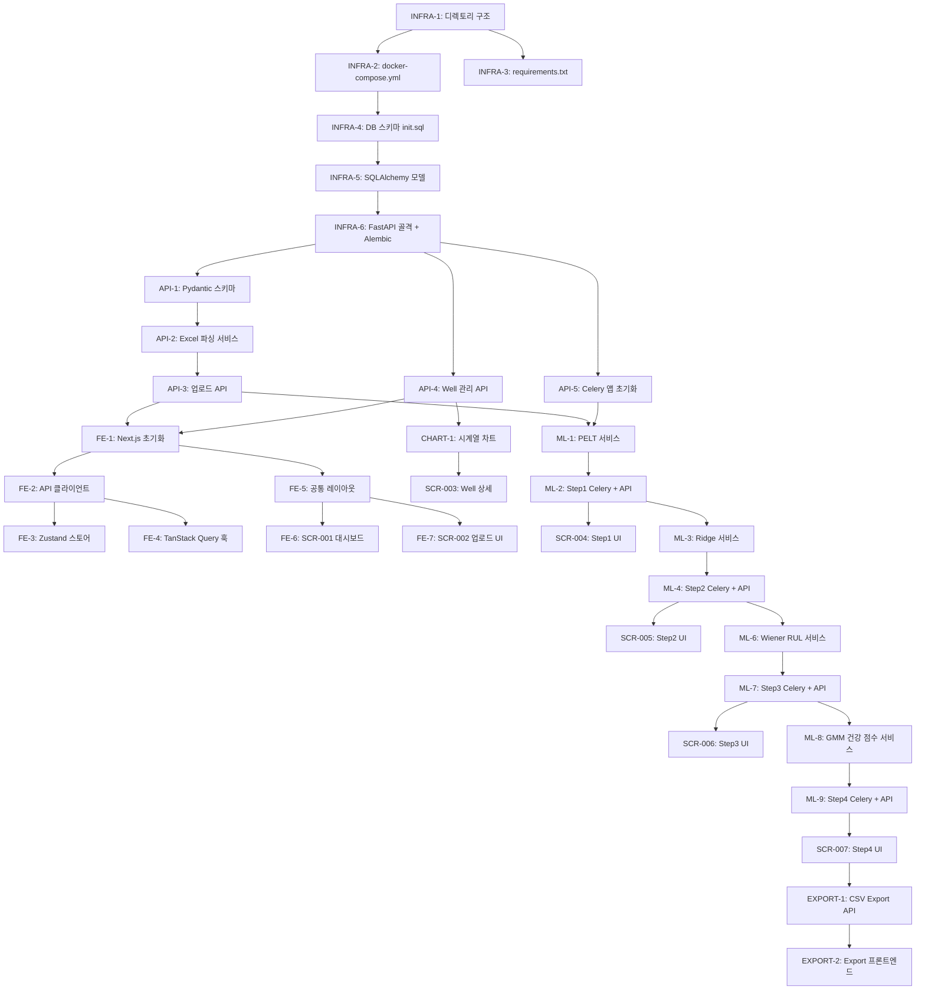

# ESP-PAS (ESP Performance Analysis System) 개발 로드맵

> **버전**: 1.0.0 | **작성일**: 2026-03-03 | **기준 PRD**: v1.1.0
> **전체 개발 기간**: 7일 (2026-03-03 ~ 2026-03-09)

---

## 개요

### 프로젝트 목적
Offshore ESP(Electric Submersible Pump)의 성능 저하를 자동 감지하고 잔여 수명(RUL)을 예측하는 웹 기반 분석 플랫폼. 엔지니어가 Excel 데이터를 업로드하면 4단계 ML 파이프라인이 자동으로 변화점 감지 → 잔차 분석 → RUL 예측 → 건강 점수 산출을 수행한다.

### 전체 개발 기간
- **총 7일** (1인 풀스택 기준)
- Day 1~2: 인프라 + 데이터 레이어
- Day 3: 프론트엔드 기반 + 업로드 UI
- Day 4~5: ML 파이프라인 (Step 1~2)
- Day 6: ML 파이프라인 (Step 3~4)
- Day 7: 통합, Export, 품질 검증

### 팀 구성 가정
- **1인 풀스택 개발자** (Backend + Frontend + DevOps 겸임)
- Python 백엔드 + Next.js 프론트엔드 경험 보유
- ML 라이브러리(ruptures, scikit-learn) 기본 이해 필요

### 핵심 기술 스택
| 레이어 | 기술 | 버전 |
|--------|------|------|
| Frontend | Next.js + React + TypeScript | **16.1** / **19.2.4** / 5.x |
| 스타일링 | Tailwind CSS + shadcn/ui | **4.2.x** |
| 차트 | react-plotly.js + plotly.js | **2.6.0** / **3.1.0** |
| 상태 관리 | Zustand + TanStack Query | **5.0.11** / **5.90.21** |
| Backend | FastAPI + SQLAlchemy + asyncpg | **0.135.1** / **2.0.48** / **0.31.0** |
| Pydantic | pydantic + pydantic-settings | **2.12.5** / **2.13.1** |
| ML | ruptures + scikit-learn + lifelines | **1.1.10** / **1.8.0** / **0.30.1** |
| 비동기 | Celery + redis-py | **5.6.2** / **7.1.1** |
| DB | TimescaleDB (PostgreSQL **16** 확장) | **2.23** |
| 컨테이너 | Docker Compose | |

---

## MVP 범위

### MVP 포함 기능

| ID | 기능명 | 우선순위 | 관련 PRD |
|----|--------|----------|----------|
| F-001 | Excel 데이터 업로드 (파싱 + Well 정규화 + DB 적재) | P0 | §3, §5 |
| F-002 | Well 대시보드 (카드 그리드, 건강 점수, 상태 배지) | P0 | §3 |
| F-003 | 시계열 성능 차트 (다중 파라미터, 날짜 범위 선택) | P0 | §3 |
| F-004 | Step 1 — PELT 변화점 감지 + 베이스라인 구간 확정 | P1 | §4 |
| F-005 | Step 2 — Ridge 회귀 잔차 분석 + 저하율 정량화 | P1 | §4 |
| F-006 | Step 3 — Wiener 프로세스 Bootstrap RUL 예측 | P1 | §4 |
| F-007 | Step 4 — GMM + 마할라노비스 건강 점수 산출 | P1 | §4 |
| F-008 | 워크플로우 순차 잠금 (Step 1→2→3→4 순서 강제) | P1 | §4, §5 |
| F-009 | CSV Export (원본 + 잔차 + 건강 점수 통합) | P2 | §3 |

### MVP 제외 기능

| 제외 항목 | 제외 이유 | 향후 Phase |
|-----------|-----------|------------|
| 인증(Auth) / 사용자 관리 | 단일 사용자 로컬 환경 가정, 복잡도 대비 MVP 가치 낮음 | Phase 2 |
| 다중 Well 동시 분석 | 단일 Well 파이프라인 검증 후 확장 필요 | Phase 2 |
| 실시간 데이터 스트리밍 | WebSocket 인프라 추가 필요, MVP 범위 초과 | Phase 3 |
| PDF Export | 레이아웃 엔진 추가 필요, CSV로 대체 가능 | Phase 2 |
| BOCPD 알고리즘 | PELT로 충분한 MVP 요구사항 충족 | Phase 2 |
| LSTM 모델 | Wiener 프로세스로 충분, GPU 인프라 불필요 | Phase 3 |
| 자동 알람 발송 | 이메일/SMS 연동 인프라 필요 | Phase 2 |
| 모바일 반응형 UI | 1280px+ 데스크톱 최적화로 충분 | Phase 2 |

---

## 단계별 계획

### Day 1: 인프라 + Docker Compose + DB 스키마

**목표**: 전체 개발 환경을 Docker Compose로 단일 명령으로 구동 가능하게 하고, TimescaleDB 스키마와 초기화 SQL을 완성한다.

**산출물**:
- 실행 가능한 `docker-compose.yml` (timescaledb, redis, backend, celery_worker, frontend 5개 서비스)
- TimescaleDB hypertable 포함 초기화 SQL (`backend/app/db/init.sql`)
- FastAPI 앱 골격 (`backend/app/main.py`)
- Alembic 마이그레이션 초기 설정
- `backend/requirements.txt` 완성

#### 태스크

- [ ] **[INFRA-1] 모노레포 디렉토리 구조 생성** `Backend/DevOps` ~30분
  - 아래 경로를 모두 생성 (파일 없이 디렉토리만)
  ```
  backend/app/api/
  backend/app/models/
  backend/app/schemas/
  backend/app/services/
  backend/app/worker/
  backend/app/db/
  backend/tests/
  backend/alembic/
  frontend/app/wells/[id]/
  frontend/components/charts/
  frontend/components/ui/
  frontend/lib/
  frontend/hooks/
  docs/
  ```

- [ ] **[INFRA-2] docker-compose.yml 작성** `DevOps` ~45분
  - 서비스 5개: `timescaledb`, `redis`, `backend`, `celery_worker`, `frontend`
  - `timescaledb`: `timescale/timescaledb:latest-pg16`, 포트 5432, 볼륨 `pgdata`
  - `redis`: `redis:7-alpine`, 포트 6379, `--appendonly yes` (영속화 필수 — Celery 작업 유실 방지)
  - `backend`: Python 3.11 슬림 이미지, 포트 8000, `backend/` 볼륨 마운트, `--reload`
  - `celery_worker`: backend와 동일 이미지, `celery -A app.worker.celery_app worker`
  - `frontend`: Node 20 alpine, 포트 3000, `frontend/` 볼륨 마운트
  - 환경 변수: `DATABASE_URL`, `REDIS_URL`, `CELERY_BROKER_URL` `.env` 파일로 분리
  - `depends_on` 설정: backend/celery_worker → timescaledb, redis

- [ ] **[INFRA-3] backend/requirements.txt 작성** `Backend` ~20분
  ```
  fastapi[standard]==0.135.1
  uvicorn[standard]
  sqlalchemy[asyncio]==2.0.48
  asyncpg==0.31.0
  alembic
  pydantic==2.12.5
  pydantic-settings==2.13.1
  celery[redis]==5.6.2
  redis==7.1.1
  pandas
  openpyxl
  ruptures==1.1.10
  scikit-learn==1.8.0
  lifelines==0.30.1
  numpy
  python-multipart   # 파일 업로드 필수
  ```

- [ ] **[INFRA-4] TimescaleDB 초기화 SQL 작성** `Backend` ~60분
  - 파일 위치: `backend/app/db/init.sql`
  - `wells` 테이블: `id(UUID PK)`, `name(VARCHAR UNIQUE)`, `field`, `latest_health_score`, `analysis_status(VARCHAR DEFAULT 'no_data')`, `created_at`, `updated_at`
  - `esp_daily_data` 테이블: `well_id(FK)`, `date(DATE NOT NULL)`, `vfd_freq`, `motor_volts`, `motor_current`, `motor_power`, `motor_temp`, `motor_vib`, `current_leak`, `pi`, `ti`, `pd`, `dd`, `whp`, `casing_pressure`, `water_cut`, `liquid_rate`, `water_rate`, `oil_haimo`, `gas_meter`, `gor`, `dp_cross_pump`, `liquid_pi`, `oil_pi`, `choke`, `flt`
  - **`SELECT create_hypertable('esp_daily_data', 'date');`** — hypertable 생성 필수
  - `analysis_sessions` 테이블: `id(UUID PK)`, `well_id(FK)`, `step_number(INT)`, `status(VARCHAR)`, `parameters(JSONB)`, `celery_task_id(VARCHAR)`, `error_message(TEXT)`, `created_at`, `updated_at`
  - `baseline_periods` 테이블: `id`, `well_id(FK)`, `start_date`, `end_date`, `changepoints(JSONB)`, `is_manually_set(BOOL)`
  - `residual_data` 테이블: `well_id`, `date`, `predicted`, `actual`, `residual`, `residual_ma30`, `degradation_rate`
  - `rul_predictions` 테이블: `well_id`, `predicted_at`, `rul_median`, `rul_p10`, `rul_p90`, `expected_failure_date`, `wiener_drift`, `wiener_diffusion`
  - `health_scores` 테이블: `well_id`, `date`, `mahalanobis_distance`, `health_score`, `health_status(VARCHAR)` — `CHECK health_status IN ('Normal','Degrading','Critical')`
  - Docker entrypoint에서 자동 실행되도록 Dockerfile에서 참조

- [ ] **[INFRA-5] SQLAlchemy ORM 모델 작성** `Backend` ~45분
  - 파일 위치: `backend/app/models/` 하위 각 엔티티별 파일
  - `backend/app/models/well.py`: `Well` 모델 (analysis_status Enum 포함)
  - `backend/app/models/esp_data.py`: `EspDailyData` 모델
  - `backend/app/models/analysis.py`: `AnalysisSession`, `BaselinePeriod`, `ResidualData`, `RulPrediction`, `HealthScore` 모델
  - `backend/app/db/database.py`: `async_engine`, `AsyncSessionLocal`, `get_db` 의존성 함수
  - `analysis_status` 상태값을 Python Enum으로 정의: `no_data`, `data_ready`, `baseline_set`, `residual_done`, `rul_done`, `fully_analyzed`

- [ ] **[INFRA-6] FastAPI 앱 골격 + Alembic 초기화** `Backend` ~30분
  - `backend/app/main.py`: FastAPI 인스턴스, CORS 미들웨어(localhost:3000 허용), 라우터 include 준비
  - `backend/app/core/config.py`: pydantic-settings로 환경 변수 관리 (`DATABASE_URL`, `REDIS_URL`, `CELERY_BROKER_URL`)
  - Alembic 초기화: `alembic init alembic`, `env.py`에 SQLAlchemy 비동기 엔진 설정
  - 초기 마이그레이션 생성: `alembic revision --autogenerate -m "init"`

**완료 기준 (DoD)**:
- `docker compose up -d` 실행 후 모든 컨테이너가 `healthy` 상태
- `curl http://localhost:8000/docs` 응답으로 FastAPI Swagger UI 접근 가능
- `curl http://localhost:8000/health` → `{"status": "ok"}` 반환
- TimescaleDB에 모든 테이블 + hypertable 생성 확인 (`\dt` 명령)

---

### Day 2: 백엔드 핵심 API — Well 관리 + Excel 업로드

**목표**: Excel 파일을 업로드하면 자동으로 Well이 생성되고 `esp_daily_data`에 모든 레코드가 적재되는 API를 완성한다.

**산출물**:
- `POST /api/upload` — Excel 파싱 + Well 정규화 + DB 적재 완성
- `GET /api/wells`, `GET /api/wells/{id}` — Well 목록/상세 API
- `GET /api/wells/{id}/data` — 날짜 범위별 시계열 조회 API
- Pydantic 스키마 완성

#### 태스크

- [ ] **[API-1] Pydantic 스키마 정의** `Backend` ~40분
  - 파일 위치: `backend/app/schemas/`
  - `well.py`: `WellResponse(id, name, field, latest_health_score, analysis_status, data_count, date_range)`, `WellListResponse`
  - `esp_data.py`: `EspDataPoint(date, vfd_freq, motor_current, motor_temp, motor_vib, pi, pd, ...)`, `EspDataResponse(well_id, data, total_count)`
  - `upload.py`: `UploadResponse(well_id, well_name, records_inserted, date_range, columns_found, warnings)`
  - `analysis.py`: `AnalysisStatusResponse(status, session_id, task_id)`

- [ ] **[API-2] Excel 파싱 서비스 구현** `Backend` ~90분
  - 파일 위치: `backend/app/services/upload_service.py`
  - `pandas.read_excel()` 로 데이터 로드 (openpyxl 엔진)
  - **Well 이름 정규화 함수** 필수: `normalize_well_name()` — 정규식으로 `LF12-3A1H` → `LF12-3-A1H` 형태 교정 (숫자-영문 사이 하이픈 삽입)
  - 컬럼 매핑 딕셔너리를 별도 상수로 분리: `COLUMN_MAPPING = {"VFD Freq": "vfd_freq", ...}` — 컬럼명 변경에 대응
  - **Null 처리 전략**: `liquid_rate`, `water_rate`, `oil_haimo`, `gas_meter` 컬럼은 NaN을 `None`으로 변환 (DB에 NULL 저장)
  - `date` 컬럼 파싱: `pd.to_datetime()` 후 `.date()` 변환, 중복 날짜 감지 시 마지막 값 우선
  - 유효성 검증: 필수 컬럼(`date`, `vfd_freq`, `pi`, `motor_current`) 존재 여부 확인, 누락 시 400 에러
  - 반환값: `(well_name, DataFrame)` — 상위 레이어에서 DB 적재 담당

- [ ] **[API-3] 업로드 API 라우터 구현** `Backend` ~60분
  - 파일 위치: `backend/app/api/upload.py`
  - `POST /api/upload`: `UploadFile` 수신 (최대 50MB — FastAPI `max_upload_size` 설정)
  - 파일 확장자 검증: `.xlsx`, `.xls`만 허용
  - 트랜잭션 처리: Well upsert → esp_daily_data bulk insert (SQLAlchemy `execute(insert(...))` 배치)
  - Well 중복 처리: `INSERT ... ON CONFLICT (name) DO UPDATE SET updated_at = now()`
  - `analysis_status`를 `data_ready`로 업데이트
  - 오류 발생 시 롤백 + 상세 오류 메시지 반환 (어떤 컬럼이 문제인지 명시)
  - 성공 시 `UploadResponse` 반환 (삽입 건수, 날짜 범위, 경고 메시지 포함)

- [ ] **[API-4] Well 관리 API 라우터 구현** `Backend` ~45분
  - 파일 위치: `backend/app/api/wells.py`
  - `GET /api/wells`: 전체 Well 목록 (최신 건강 점수, 상태, 데이터 건수 포함)
  - `GET /api/wells/{well_id}`: 단일 Well 상세 (데이터 범위, 현재 분석 상태 포함)
  - `GET /api/wells/{well_id}/data`: 날짜 범위 파라미터 (`start_date`, `end_date`, `columns` 쿼리 파라미터)
    - `columns` 미지정 시 전체 컬럼 반환
    - TimescaleDB 날짜 인덱스 활용 (`WHERE date BETWEEN :start AND :end`)
    - 최대 반환 행 수 제한: 3000행 (차트 렌더링 성능)

- [ ] **[API-5] Celery 앱 초기화** `Backend` ~30분
  - 파일 위치: `backend/app/worker/celery_app.py`
  - Celery 인스턴스 생성: `broker=REDIS_URL`, `backend=REDIS_URL`
  - `task_serializer='json'`, `result_serializer='json'`, `task_track_started=True`
  - **Redis 영속화 확인**: `redis.conf`에 `appendonly yes` 설정 (docker-compose.yml에서 커맨드로 전달)
  - `GET /api/tasks/{task_id}` 라우터: Celery `AsyncResult`로 상태 조회 (`PENDING`, `STARTED`, `SUCCESS`, `FAILURE`)

- [ ] **[API-6] API 통합 테스트 작성** `Backend` ~40분
  - 파일 위치: `backend/tests/test_upload.py`
  - `Production Data.xlsx`를 실제 테스트 픽스처로 사용
  - 테스트 항목: 정상 업로드, 컬럼 누락 오류, Well 이름 정규화 검증, 중복 업로드(덮어쓰기)
  - `pytest-asyncio` + `httpx.AsyncClient` 사용

**완료 기준 (DoD)**:
- `curl -X POST http://localhost:8000/api/upload -F "file=@Production\ Data.xlsx"` 성공
- DB에 `wells` 1건, `esp_daily_data` 464건 적재 확인
- `GET /api/wells` 응답에 `LF12-3-A1H` (정규화된 이름) 포함
- `GET /api/wells/{id}/data?start_date=2023-09-22&end_date=2023-12-31` 정상 응답
- 모든 단위 테스트 통과 (`pytest tests/test_upload.py -v`)

---

### Day 3: 프론트엔드 기반 + 대시보드 + 업로드 UI

**목표**: Next.js 프로젝트를 초기화하고, Well 대시보드(SCR-001)와 파일 업로드 화면(SCR-002)을 완성한다. 공통 레이아웃과 API 클라이언트도 이 단계에서 구축한다.

**산출물**:
- Next.js 15 프로젝트 초기화 + shadcn/ui 설정
- `frontend/lib/api.ts` — API 클라이언트
- `frontend/lib/store.ts` — Zustand 스토어
- SCR-001: Well 대시보드 (`/`)
- SCR-002: 파일 업로드 (`/upload`)
- 공통 레이아웃 (사이드바 + 워크플로우 진행 표시줄)

#### 태스크

- [ ] **[FE-1] Next.js 프로젝트 초기화 + 패키지 설치** `Frontend` ~30분
  - `npx create-next-app@latest frontend --typescript --tailwind --app --no-src-dir`
  - 추가 패키지 설치:
    ```bash
    npm install zustand @tanstack/react-query react-plotly.js plotly.js
    npm install @tanstack/react-query-devtools
    npm install -D @types/plotly.js
    npx shadcn@latest init
    npx shadcn@latest add card badge button progress table skeleton toast
    ```
  - `tailwind.config.ts`에 `darkMode: 'class'` 추가 (다크모드 준비)
  - `next.config.ts`에 백엔드 API proxy 설정: `/api/*` → `http://backend:8000/api/*` (Docker 네트워크 내 통신)

- [ ] **[FE-2] API 클라이언트 구현** `Frontend` ~40분
  - 파일 위치: `frontend/lib/api.ts`
  - 기본 fetch 래퍼: `apiFetch(path, options)` — `NEXT_PUBLIC_API_URL` 환경 변수 기반
  - 에러 처리: HTTP 4xx/5xx를 `ApiError` 클래스로 변환 (status code + message)
  - 함수 목록 (모두 타입 안전):
    - `getWells(): Promise<Well[]>`
    - `getWell(id: string): Promise<Well>`
    - `getWellData(id, params): Promise<EspDataResponse>`
    - `uploadFile(file: File): Promise<UploadResponse>`
    - `getTaskStatus(taskId: string): Promise<TaskStatus>`
    - `runStep1(wellId, params): Promise<{task_id: string}>`
    - `getStep1Result(wellId): Promise<Step1Result>`
    - (Step 2~4 동일 패턴)
    - `exportCsv(wellId): Promise<Blob>`

- [ ] **[FE-3] Zustand 스토어 구현** `Frontend` ~30분
  - 파일 위치: `frontend/lib/store.ts`
  - `useWellStore`: `selectedWellId`, `setSelectedWellId`
  - `useAnalysisStore`: `activeStep`, `taskIds(step1~4)`, `setTaskId`, `clearTasks`
  - 스토어 간 의존성 없이 독립적으로 유지 (서버 상태는 TanStack Query로 관리)

- [ ] **[FE-4] TanStack Query 훅 구현** `Frontend` ~40분
  - 파일 위치: `frontend/hooks/`
  - `useWells.ts`: `useQuery(['wells'])` — 60초 staleTime
  - `useWell.ts`: `useQuery(['well', id])`
  - `useWellData.ts`: `useQuery(['wellData', id, params])` — 날짜 범위 파라미터 포함
  - `useTaskPolling.ts`: `useQuery(['task', taskId], { refetchInterval: 2000, enabled: !!taskId })` — `SUCCESS`/`FAILURE` 시 폴링 중단
  - `useStep1.ts` ~ `useStep4.ts`: 결과 조회 훅 (POST는 `useMutation`)

- [ ] **[FE-5] 공통 레이아웃 구현** `Frontend` ~60분
  - 파일 위치: `frontend/app/layout.tsx`
  - 구조: `<Sidebar> | <main>`
  - `Sidebar` 컴포넌트 (`frontend/components/layout/Sidebar.tsx`):
    - 상단: 로고 + "ESP-PAS" 텍스트
    - Well 목록: `useWells` 훅으로 조회, 각 Well에 건강 점수 배지 표시
    - 클릭 시 `/wells/[id]`로 라우팅
    - `+ 데이터 업로드` 버튼 → `/upload`
  - `WorkflowBar` 컴포넌트 (`frontend/components/layout/WorkflowBar.tsx`):
    - Step 1~4 진행 표시 (완료/진행중/잠금 상태)
    - `analysis_status`에 따라 상태 배지 색상: 완료(초록), 진행중(노랑), 잠금(회색)
  - TanStack Query Provider + Zustand devtools 설정

- [ ] **[FE-6] SCR-001 Well 대시보드 구현** `Frontend` ~60분
  - 파일 위치: `frontend/app/page.tsx`
  - 상단 집계 지표 카드 3개: 전체 Well 수, 정상 Well 수(건강점수 ≥70), 위험 Well 수(<40)
  - Well 카드 그리드 (2~3열): 각 카드에 Well 이름, 건강 점수 게이지, 상태 배지(`Normal`/`Degrading`/`Critical`), 최근 측정 날짜, 분석 상태
  - 건강 점수 없는 경우(`no_data`, `data_ready`): "분석 대기중" 표시
  - 카드 클릭 → `/wells/[id]` 이동
  - 데이터 없을 때: "데이터를 업로드하세요" 빈 상태(Empty State) UI + 업로드 버튼
  - `useWells` 훅 연결, 30초 자동 갱신(`refetchInterval: 30000`)

- [ ] **[FE-7] SCR-002 파일 업로드 UI 구현** `Frontend` ~75분
  - 파일 위치: `frontend/app/upload/page.tsx`
  - 드래그앤드롭 영역: `react-dropzone` 또는 네이티브 drag event 처리
  - 파일 선택 시: 파일명, 크기, 확장자 미리보기
  - 업로드 진행 상황: `XMLHttpRequest`로 `onprogress` 이벤트 핸들링 (Fetch API는 progress 미지원)
  - 결과 화면: 업로드 성공 시 삽입 건수, 날짜 범위, Well 이름 표시
  - 경고 메시지 표시: null 비율 높은 컬럼, Well 이름 정규화 내역
  - 오류 화면: HTTP 에러 메시지 + 재시도 버튼
  - 완료 후 `router.push('/')` 또는 해당 Well 상세로 이동

**완료 기준 (DoD)**:
- `http://localhost:3000` 접속 시 Well 대시보드 렌더링 (데이터 없을 때 Empty State 표시)
- `/upload`에서 `Production Data.xlsx` 드래그앤드롭 업로드 성공
- 업로드 후 대시보드에 `LF12-3-A1H` Well 카드 표시
- 사이드바에서 Well 클릭 시 `/wells/[id]`로 정상 라우팅

---

### Day 4: Well 상세 + 시계열 차트 + Step 1 (PELT)

**목표**: Well 상세 페이지의 시계열 차트(SCR-003)를 완성하고, Step 1 PELT 변화점 감지 백엔드 서비스와 UI(SCR-004)를 구현한다.

**산출물**:
- SCR-003: Well 상세 시계열 차트 (Plotly.js 다중 축)
- `backend/app/services/step1_pelt.py` — PELT 알고리즘
- `POST/GET /api/wells/{id}/analysis/step1` API
- SCR-004: Step 1 UI (변화점 차트 + 베이스라인 구간 선택)

#### 태스크

- [ ] **[CHART-1] Plotly.js 시계열 차트 컴포넌트 구현** `Frontend` ~90분
  - 파일 위치: `frontend/components/charts/TimeSeriesChart.tsx`
  - `react-plotly.js`의 `Plot` 컴포넌트 래핑
  - Props: `data: EspDataPoint[]`, `selectedColumns: string[]`, `changepoints?: string[]`, `annotations?: PlotAnnotation[]`
  - 다중 Y축 설정: 압력(Pi, Pd)은 yaxis2, 주파수(VFD Freq)는 yaxis1, 전류(Motor Current)는 yaxis3
  - **변화점 어노테이션**: `changepoints` prop으로 날짜 배열 수신 시 수직선(`vline`) + 텍스트 레이블 자동 생성
  - 레이아웃: `autosize: true`, `responsive: true`, `hovermode: 'x unified'` (마우스 오버 시 같은 날짜 데이터 일괄 표시)
  - 줌/팬: Plotly 기본 기능 활용 (`scrollZoom: true`)
  - 차트 하단 날짜 범위 슬라이더: `rangeslider` 옵션 활성화

- [ ] **[CHART-2] 컬럼 선택 체크박스 UI 구현** `Frontend` ~30분
  - 파일 위치: `frontend/components/charts/ColumnSelector.tsx`
  - 컬럼 그룹화: 전기계통 / 압력계통 / 생산량
  - 기본 선택: `vfd_freq`, `motor_current`, `pi`, `pd` (4개)
  - 선택된 컬럼 목록을 Zustand 또는 로컬 state로 관리

- [ ] **[SCR-003] Well 상세 페이지 구현** `Frontend` ~60분
  - 파일 위치: `frontend/app/wells/[id]/page.tsx`
  - 상단: Well 이름, 현재 분석 상태 배지, 데이터 범위 텍스트
  - 날짜 범위 선택 UI: `DateRangePicker` 컴포넌트 (shadcn/ui Calendar 기반)
  - `TimeSeriesChart` + `ColumnSelector` 조합 배치
  - 워크플로우 패널: Step 1~4 카드 (완료/대기/잠금), 각 카드에서 해당 Step 페이지로 이동 버튼
  - `useWell(id)`, `useWellData(id, dateRange)` 훅 연결

- [ ] **[ML-1] Step 1 PELT 서비스 구현** `Backend` ~90분
  - 파일 위치: `backend/app/services/step1_pelt.py`
  - 함수 시그니처: `run_pelt(well_id: str, penalty: float = 3.0, columns: list[str] = None) -> dict`
  - `columns` 기본값: `["vfd_freq", "pi"]` (변화점 감지에 가장 민감한 두 채널)
  - 구현 단계:
    1. DB에서 `esp_daily_data` 전체 로드 → pandas DataFrame
    2. null 행 제거 (vfd_freq, pi 기준)
    3. 다변량 시계열을 numpy array로 변환
    4. `ruptures.Pelt(model='rbf').fit(signal).predict(pen=penalty)` 실행
    5. 변화점 인덱스 → 날짜로 역변환
    6. 변화점 사이 구간을 베이스라인 후보로 자동 선정 (가장 긴 초기 안정 구간)
  - 반환값: `{changepoints: ["2023-11-01", ...], baseline_start: "...", baseline_end: "...", signal_length: int}`
  - **penalty 파라미터 노출 필수**: UI에서 조정 가능하게 설계 (기본값 3.0, 낮을수록 변화점 많이 감지)

- [ ] **[ML-2] Step 1 Celery 태스크 + API 라우터** `Backend` ~60분
  - 파일 위치: `backend/app/worker/tasks.py`, `backend/app/api/analysis.py`
  - `task_run_step1(well_id, penalty)`: Celery 태스크
    - 시작 시 `analysis_sessions` 상태 `running`으로 업데이트
    - 완료 시 `baseline_periods` 테이블 upsert + `wells.analysis_status` = `baseline_set`
    - 실패 시 `analysis_sessions.error_message` 저장
  - `POST /api/wells/{id}/analysis/step1`: `penalty` 파라미터 수신 → 태스크 enqueue → `{task_id}` 반환
  - `GET /api/wells/{id}/analysis/step1`: `baseline_periods` 테이블에서 결과 조회
  - `PUT /api/wells/{id}/analysis/step1/baseline`: 수동 베이스라인 구간 지정 (`is_manually_set = True`)

- [ ] **[SCR-004] Step 1 UI 구현** `Frontend` ~75분
  - 파일 위치: `frontend/app/wells/[id]/step1/page.tsx`
  - **penalty 슬라이더**: 0.5~10.0 범위, 현재 값 표시, 변경 시 즉시 적용 버튼 활성화
  - "분석 실행" 버튼 → `POST step1` → `task_id` 수신 → `useTaskPolling` 훅으로 폴링 시작
  - 폴링 중 Skeleton 로딩 + 진행 메시지 표시
  - 결과 차트: 시계열 위에 변화점 수직선 어노테이션 표시
  - 베이스라인 구간 표시: 선택된 구간을 배경색으로 하이라이트
  - 수동 베이스라인 지정 UI: 날짜 범위 입력 + "베이스라인 적용" 버튼

**완료 기준 (DoD)**:
- Well 상세 페이지에서 시계열 차트 정상 렌더링 (464개 데이터 포인트)
- Step 1 실행 시 Celery 태스크 비동기 처리 + 2초 폴링 동작 확인
- PELT 결과로 변화점 날짜 목록 및 베이스라인 구간 DB 저장 확인
- 차트에 변화점 수직선 어노테이션 표시
- `analysis_status`가 `baseline_set`으로 업데이트

---

### Day 5: Step 2 — Ridge 회귀 잔차 분석

**목표**: 베이스라인 구간 데이터로 Ridge 회귀 모델을 학습하고, 전체 기간에 대한 잔차(성능 저하 지표)를 계산한다. 저하율(%/month)과 R² 지표를 산출한다.

**산출물**:
- `backend/app/services/step2_ridge.py` — Ridge 회귀 + 잔차 분석
- `POST/GET /api/wells/{id}/analysis/step2` API
- SCR-005: Step 2 UI (잔차 차트 + 저하율 카드)

#### 태스크

- [ ] **[ML-3] Step 2 Ridge 회귀 서비스 구현** `Backend` ~120분
  - 파일 위치: `backend/app/services/step2_ridge.py`
  - 함수 시그니처: `run_ridge(well_id: str, alpha: float = 1.0) -> dict`
  - 구현 단계:
    1. DB에서 `baseline_periods` 조회 → 베이스라인 구간 날짜 범위 획득
    2. 베이스라인 구간 `esp_daily_data` 로드 → X: `vfd_freq`, y: `pi`
    3. Null 행 제거 후 `Ridge(alpha=alpha)` 학습
    4. **전체 기간** `vfd_freq` 데이터로 예측: `pi_predicted`
    5. 잔차 계산: `residual = pi_actual - pi_predicted` (음수 = 성능 저하)
    6. 30일 이동 평균 계산: `residual_ma30 = pd.Series(residual).rolling(30).mean()`
    7. 저하율 계산: `residual_ma30`에 선형 회귀 적합 → 기울기(단위: bar/day) → `/month` 변환
    8. R² 계산: 베이스라인 구간 내 예측값 기준
  - 반환값: `{r_squared: float, degradation_rate_per_month: float, model_params: {coef, intercept}, data: [{date, predicted, actual, residual, residual_ma30}]}`
  - **최소 데이터 검증**: 베이스라인 구간이 30일 미만이면 `ValueError` 발생 + 명확한 메시지
  - `alpha` 파라미터 UI 노출 (기본 1.0)

- [ ] **[ML-4] Step 2 Celery 태스크 + API 라우터** `Backend` ~45분
  - `task_run_step2(well_id, alpha)`: Celery 태스크
    - 시작 전 `analysis_status == 'baseline_set'` 검증 (미충족 시 `ValueError`)
    - 완료 시 `residual_data` 테이블 bulk upsert + `wells.analysis_status` = `residual_done`
  - `POST /api/wells/{id}/analysis/step2`: `alpha` 파라미터 수신 → 태스크 enqueue
  - `GET /api/wells/{id}/analysis/step2`: `residual_data` + 저하율 통계 반환
  - Step 순서 잠금 미들웨어 또는 데코레이터로 공통화: `require_status(min_status)` 유틸리티 함수

- [ ] **[ML-5] Step 2 단위 테스트 작성** `Backend` ~40분
  - 파일 위치: `backend/tests/test_step2.py`
  - 테스트 항목:
    - R² ≥ 0.80 검증 (PRD 성공 지표 §9)
    - 잔차 부호 검증 (베이스라인 구간에서 평균 잔차 ≈ 0)
    - 저하율 단위 변환 검증
    - 베이스라인 데이터 부족 시 에러 반환 확인

- [ ] **[SCR-005] Step 2 UI 구현** `Frontend` ~75분
  - 파일 위치: `frontend/app/wells/[id]/step2/page.tsx`
  - 상단 지표 카드 3개: **R² 값**, **저하율(%/month)**, **분석 기간**
  - R² < 0.80이면 경고 배지 표시 ("모델 정확도가 낮습니다")
  - 잔차 차트 (`frontend/components/charts/ResidualChart.tsx`):
    - Y축 1: 원본 `pi` vs 예측 `pi_predicted` (두 선)
    - Y축 2: 잔차 값 (바 차트 또는 영역 차트)
    - 30일 이동 평균선 별도 색상으로 표시
    - X축: 날짜, 베이스라인 구간 배경 하이라이트
  - `alpha` 파라미터 입력 (기본 1.0) + 재실행 버튼
  - "Step 3으로 진행" 버튼 (잔차 분석 완료 후 활성화)

**완료 기준 (DoD)**:
- Step 2 실행 후 `residual_data` 테이블에 464행 저장 확인
- `GET /api/wells/{id}/analysis/step2` 응답에 `r_squared`, `degradation_rate_per_month` 포함
- R² ≥ 0.80 달성 (Production Data.xlsx 기준)
- 잔차 차트에 원본/예측 Pi와 잔차 동시 표시
- `analysis_status`가 `residual_done`으로 업데이트
- 단위 테스트 전체 통과

---

### Day 6: Step 3 (RUL 예측) + Step 4 (건강 점수)

**목표**: Wiener 프로세스 Bootstrap으로 RUL P10/P50/P90을 예측하고, GMM + 마할라노비스 거리로 건강 점수를 산출한다. 두 Step은 병렬로 개발 가능하다.

**산출물**:
- `backend/app/services/step3_rul.py` — Wiener 프로세스 RUL
- `backend/app/services/step4_health.py` — GMM 건강 점수
- 각 Step의 API 라우터 + Celery 태스크
- SCR-006, SCR-007 UI

#### 태스크

- [ ] **[ML-6] Step 3 Wiener 프로세스 RUL 서비스 구현** `Backend` ~120분
  - 파일 위치: `backend/app/services/step3_rul.py`
  - 함수 시그니처: `run_rul(well_id: str, threshold: float = -2.0, n_bootstrap: int = 1000) -> dict`
  - `threshold`: 잔차 이동 평균이 이 값 이하로 떨어지면 "고장" 판정 (엔지니어가 UI에서 조정 가능)
  - 구현 단계:
    1. DB에서 `residual_data` 로드 → `residual_ma30` 시계열 추출
    2. **최소 90일 데이터 검증** 필수 — 미충족 시 `ValueError: Wiener 모델 수렴 불가, 최소 90일 필요`
    3. Wiener 드리프트(μ) + 확산(σ²) 추정: 연속 차분의 평균/분산으로 MLE 추정
    4. Bootstrap 1000회 반복:
       - 잔차 차분 리샘플링 → 누적합으로 미래 경로 시뮬레이션
       - 각 경로에서 `threshold` 도달 시점(일수) 기록
    5. RUL 분포에서 P10, P50(중앙값), P90 추출
    6. 예상 고장일: `오늘 날짜 + RUL P50`
  - 반환값: `{rul_median: int, rul_p10: int, rul_p90: int, expected_failure_date: date, wiener_drift: float, wiener_diffusion: float, simulation_paths: [[float]]}` (paths는 차트용, 100개 샘플만)
  - **PRD 성공 지표**: P10~P90 신뢰 구간 < 6개월(180일) 목표

- [ ] **[ML-7] Step 3 Celery 태스크 + API** `Backend` ~40분
  - `task_run_step3(well_id, threshold, n_bootstrap)`: Celery 태스크
    - `analysis_status == 'residual_done'` 검증
    - 완료 시 `rul_predictions` upsert + `analysis_status` = `rul_done`
  - `POST /api/wells/{id}/analysis/step3`: `threshold`, `n_bootstrap` 파라미터
  - `GET /api/wells/{id}/analysis/step3`: `rul_predictions` 결과 반환

- [ ] **[ML-8] Step 4 GMM 건강 점수 서비스 구현** `Backend` ~90분
  - 파일 위치: `backend/app/services/step4_health.py`
  - 함수 시그니처: `run_health_score(well_id: str, n_components: int = 2) -> dict`
  - **입력 피처 6개**: `vfd_freq`, `motor_current`, `motor_temp`, `motor_vib`, `pi`, `pd`
  - 구현 단계:
    1. DB에서 전체 기간 6개 피처 데이터 로드
    2. Null이 있는 행 제거 (6개 컬럼 모두 유효한 날짜만 사용)
    3. `StandardScaler`로 정규화 (피처 스케일 차이 보정)
    4. 베이스라인 구간 데이터로 `GaussianMixture(n_components=2)` 학습
    5. 학습된 GMM에서 마할라노비스 거리 계산:
       - 가장 확률이 높은 컴포넌트의 평균/공분산 행렬 추출
       - `scipy.spatial.distance.mahalanobis()` 또는 수동 계산
    6. 거리를 0~100 점수로 정규화: `score = 100 * exp(-k * distance)` (k 조정으로 감도 제어)
    7. 상태 분류: 100~70 Normal, 69~40 Degrading, 39~0 Critical
  - 반환값: `[{date, mahalanobis_distance, health_score, health_status}]` (전체 기간 일별)

- [ ] **[ML-9] Step 4 Celery 태스크 + API** `Backend` ~35분
  - `task_run_step4(well_id, n_components)`: Celery 태스크
    - `analysis_status == 'rul_done'` 검증
    - 완료 시 `health_scores` bulk upsert + `wells.latest_health_score` 업데이트 + `analysis_status` = `fully_analyzed`
  - `POST /api/wells/{id}/analysis/step4`
  - `GET /api/wells/{id}/analysis/step4`: 전체 기간 건강 점수 시계열 반환

- [ ] **[SCR-006] Step 3 RUL 예측 UI 구현** `Frontend` ~75분
  - 파일 위치: `frontend/app/wells/[id]/step3/page.tsx`
  - 상단 KPI 카드 4개: **RUL P50(일)**, **RUL P10(최악)**, **RUL P90(최선)**, **예상 고장일**
  - RUL 예측 차트 (`frontend/components/charts/RulChart.tsx`):
    - X축: 미래 날짜 (오늘부터 예상 고장일 이후까지)
    - Y축: 잔차 시뮬레이션 경로 값
    - 100개 Bootstrap 경로를 반투명 회색 선으로 표시
    - P10/P50/P90 날짜에 수직선 + 레이블
    - 현재 날짜 기준 수직선 (파란색)
  - `threshold` 슬라이더: -5.0 ~ 0.0 범위 (기본 -2.0)
  - 신뢰 구간 경고: P90 - P10 > 180일이면 "신뢰 구간이 넓습니다. 데이터를 확인하세요" 경고

- [ ] **[SCR-007] Step 4 건강 점수 UI 구현** `Frontend` ~75분
  - 파일 위치: `frontend/app/wells/[id]/step4/page.tsx`
  - 상단: 현재 건강 점수 대형 게이지 (0~100, 색상 구분)
  - 건강 점수 시계열 차트 (`frontend/components/charts/HealthScoreChart.tsx`):
    - Y축 0~100, 70/40 임계선 수평 점선 표시
    - 상태 구간별 배경색: 0~40 빨강, 40~70 노랑, 70~100 초록
    - 포인트에 마우스 오버 시 마할라노비스 거리 + 날짜 툴팁
  - 최근 30일 상태 분포 도넛 차트 (Normal/Degrading/Critical 비율)
  - "분석 완료 — CSV Export" 버튼 (F-009 연결)

- [ ] **[ML-10] Step 3, 4 단위 테스트** `Backend` ~40분
  - `backend/tests/test_step3.py`: 최소 데이터 미충족 시 에러, P10 ≤ P50 ≤ P90 검증
  - `backend/tests/test_step4.py`: 건강 점수 범위(0~100) 검증, 상태 분류 경계값 테스트

**완료 기준 (DoD)**:
- Step 3: RUL P10/P50/P90 값이 DB에 저장, 예상 고장일 계산됨
- Step 4: `health_scores` 테이블에 전체 기간(464일) 레코드 저장
- `wells.latest_health_score` 업데이트 확인
- `analysis_status`가 `fully_analyzed`로 업데이트
- 건강 점수 차트에서 70/40 임계선 표시 확인
- 모든 단위 테스트 통과

---

### Day 7: CSV Export + 통합 테스트 + 버그 수정 + 최종 점검

**목표**: CSV Export(F-009) 구현, 전체 워크플로우 E2E 통합 테스트, PRD 비기능 요구사항 검증, 버그 수정 및 코드 정리.

**산출물**:
- `GET /api/wells/{id}/export` CSV 다운로드 API
- 전체 워크플로우 E2E 테스트 통과
- PRD 성공 지표 검증 리포트

#### 태스크

- [ ] **[EXPORT-1] CSV Export API 구현** `Backend` ~45분
  - 파일 위치: `backend/app/api/export.py`
  - `GET /api/wells/{id}/export`: 다음 컬럼을 JOIN한 통합 CSV 반환
    - `esp_daily_data` (원본 30개 컬럼) + `residual` + `residual_ma30` + `health_score` + `health_status`
    - pandas `DataFrame.to_csv()` → `StreamingResponse(io.StringIO, media_type='text/csv')`
    - `Content-Disposition: attachment; filename="LF12-3-A1H_export.csv"` 헤더 설정
  - 분석 미완료 Well: 가용한 컬럼만 포함 (residual, health_score는 NULL)

- [ ] **[EXPORT-2] CSV Export 프론트엔드 연결** `Frontend` ~20분
  - `frontend/lib/api.ts`의 `exportCsv(wellId)` 함수 구현
  - `Blob` 수신 후 `URL.createObjectURL()` + `<a>` 클릭으로 다운로드 트리거
  - Step 4 완료 후 "Export CSV" 버튼 활성화 (SCR-007에 이미 버튼 배치됨)

- [ ] **[QA-1] 워크플로우 순서 잠금 최종 검증** `Backend/Frontend` ~40분
  - 각 Step API에서 이전 Step 미완료 시 `HTTP 422 Unprocessable Entity` 반환 확인
  - 프론트엔드 Step 버튼 비활성화 상태 확인 (잠금된 Step은 클릭 불가)
  - `analysis_status` 상태 전이가 올바른 순서로만 진행되는지 확인:
    `no_data → data_ready → baseline_set → residual_done → rul_done → fully_analyzed`

- [ ] **[QA-2] PRD 비기능 요구사항 검증** `QA` ~60분
  - **API 응답 시간 < 500ms**: `curl -w "%{time_total}"` 로 Well 목록, 시계열 데이터 측정
  - **ML 분석 < 30초/Step**: 각 Step Celery 태스크 실행 시간 로그 확인
  - **파일 업로드 50MB 제한**: FastAPI `max_upload_size` 설정 확인
  - **브라우저 호환성**: Chrome, Firefox, Safari에서 차트 렌더링 확인
  - **1280px 이상 레이아웃**: 브라우저 창 크기별 레이아웃 확인

- [ ] **[QA-3] PRD 성공 지표 검증** `QA` ~45분
  - **Excel 업로드 성공률 ≥ 95%**: `Production Data.xlsx` 3회 이상 반복 업로드 테스트
  - **R² ≥ 0.80**: Step 2 결과에서 `r_squared` 값 확인 및 로그 기록
  - **RUL 신뢰 구간 < 180일**: P90 - P10 값 확인
  - **건강 점수 정합성**: 엔지니어가 알고 있는 ESP 저하 시점과 건강 점수 하락 시점 비교
  - 검증 결과를 `docs/QA_REPORT.md`에 기록

- [ ] **[QA-4] Celery 재시작/유실 시나리오 테스트** `DevOps` ~30분
  - 분석 중 `docker compose restart celery_worker` → 태스크 재개 여부 확인
  - Redis 재시작 후 진행 중인 작업 상태 확인 (`appendonly yes` 영속화 효과 검증)
  - 실패 태스크에 대한 `error_message` DB 저장 확인

- [ ] **[POLISH-1] 에러 처리 + 사용자 피드백 강화** `Frontend` ~45분
  - 모든 API 오류를 `toast` 알림으로 표시 (shadcn/ui Toaster 사용)
  - 로딩 상태: 차트 Skeleton, 버튼 스피너
  - Celery 태스크 실패 시: 에러 메시지 표시 + "재시도" 버튼
  - 빈 상태(Empty State): 각 Step 결과 없을 때 안내 메시지

- [ ] **[POLISH-2] 코드 정리 + 타입 검증** `Frontend/Backend` ~45분
  - `npx tsc --noEmit` 타입 오류 0개 확인
  - `npm run lint` ESLint 경고/오류 해결
  - `pytest` 전체 테스트 통과
  - 사용하지 않는 import, 주석 처리된 코드 제거
  - `backend/app/` 전체에서 `TODO`, `FIXME` 태그 검색 후 처리 또는 이슈 등록

- [ ] **[DOC-1] 개발 환경 설정 문서 작성** `DevOps` ~30분
  - `docs/SETUP.md` 작성: Docker Compose 시작부터 데이터 업로드까지 단계별 가이드
  - 환경 변수 예시: `.env.example` 파일 생성
  - 자주 발생하는 오류 + 해결책 섹션 포함

**완료 기준 (DoD)**:
- `Production Data.xlsx` 업로드 → Step 1~4 전체 완료 → CSV 다운로드까지 오류 없이 동작
- 모든 PRD 성공 지표 달성 확인 또는 미달 사유 문서화
- `npx tsc --noEmit` + `npm run lint` + `pytest` 모두 통과
- `docs/QA_REPORT.md`에 검증 결과 기록

---

## 마일스톤

| 마일스톤 | 목표일 | 검증 항목 |
|---------|--------|----------|
| M1: 인프라 완성 | Day 1 (2026-03-03) | docker compose up 5개 서비스 모두 healthy |
| M2: 데이터 파이프라인 완성 | Day 2 (2026-03-04) | Excel 업로드 → TimescaleDB 464건 적재 |
| M3: 프론트엔드 기반 완성 | Day 3 (2026-03-05) | 대시보드 + 업로드 UI 동작 확인 |
| M4: Step 1 완성 | Day 4 (2026-03-06) | PELT 변화점 감지 + 차트 어노테이션 표시 |
| M5: Step 2 완성 | Day 5 (2026-03-07) | Ridge R² ≥ 0.80, 잔차 차트 표시 |
| M6: Step 3~4 완성 | Day 6 (2026-03-08) | RUL 예측 + 건강 점수 전체 동작 |
| M7: MVP 완성 | Day 7 (2026-03-09) | E2E 워크플로우 + CSV Export + QA 통과 |

---

## 리스크 및 대응 전략

| 리스크 | 심각도 | 발생 가능성 | 대응 전략 |
|--------|--------|------------|----------|
| Excel 컬럼 형식 변경 (업로드 실패) | 높음 | 중간 | `COLUMN_MAPPING` 딕셔너리를 `backend/app/core/column_config.py`로 분리. 파싱 실패 시 어떤 컬럼이 누락인지 상세 에러 반환. `warnings` 필드로 비필수 컬럼 누락은 경고 처리 |
| PELT 변화점 과/과소 감지 | 높음 | 높음 | `penalty` 파라미터를 UI 슬라이더로 노출 (0.5~10.0). 수동 베이스라인 지정 기능 필수 구현. 여러 penalty 값으로 미리 테스트하여 Production Data.xlsx 기본값 최적화 |
| Wiener 모델 수렴 실패 (데이터 부족) | 중간 | 낮음 | `run_rul()` 진입 전 잔차 데이터 90일 이상 검증. 미충족 시 `HTTP 422 + 상세 메시지` 반환. Celery 태스크에서 예외 캐치 후 `error_message` DB 저장 |
| TimescaleDB Docker 초기화 순서 문제 | 중간 | 중간 | `init.sql`을 Docker entrypoint에서 실행. `backend`/`celery_worker`의 `depends_on`에 `timescaledb: { condition: service_healthy }` 설정. healthcheck: `pg_isready` |
| Celery 작업 유실 (Redis 재시작) | 낮음 | 낮음 | Redis `appendonly yes` 영속화 필수. `analysis_sessions.celery_task_id` DB 저장으로 재시작 시 상태 복구 가능하게 설계 |
| react-plotly.js SSR 오류 | 중간 | 높음 | 차트 컴포넌트에 `dynamic import + ssr: false` 적용 필수. `next/dynamic`으로 클라이언트 전용 렌더링 강제 |
| Step 4 GMM 수렴 불안정 | 중간 | 낮음 | `n_init=10`, `random_state=42` 설정으로 재현성 확보. 베이스라인 데이터가 충분하지 않으면 `n_components=1`로 폴백 |

---

## 기술 의존성 다이어그램



---

## 진행 추적

### 전체 태스크 수: 40개

| Phase | 태스크 수 | 예상 소요 시간 | 담당 영역 |
|-------|----------|--------------|----------|
| Day 1 (인프라) | 6개 | ~4.5시간 | Backend / DevOps |
| Day 2 (백엔드 API) | 6개 | ~5.5시간 | Backend |
| Day 3 (프론트엔드 기반) | 7개 | ~5.5시간 | Frontend |
| Day 4 (차트 + Step 1) | 6개 | ~6.5시간 | Frontend / Backend / ML |
| Day 5 (Step 2) | 5개 | ~5.5시간 | Backend / ML / Frontend |
| Day 6 (Step 3 + 4) | 6개 | ~7.5시간 | Backend / ML / Frontend |
| Day 7 (통합 + QA) | 8개 | ~5.5시간 | 전체 |
| **합계** | **40개** | **~40시간** | |

### Phase별 기술 영역 분포
- Backend: 22개 태스크 (55%)
- Frontend: 13개 태스크 (32%)
- DevOps/QA: 5개 태스크 (13%)

---

## 참고사항

### 개발 환경 설정
- 상세 설정 가이드: `docs/SETUP.md` (Day 7 DOC-1에서 생성 예정)
- Docker Compose 빠른 시작: `docker compose up -d` (5개 서비스 일괄 시작)
- 환경 변수: `.env.example` 복사 후 `.env`로 이름 변경

### 핵심 주의사항 (개발 전 반드시 확인)

1. **react-plotly.js SSR 비활성화 필수**
   ```typescript
   // frontend/components/charts/TimeSeriesChart.tsx
   // next/dynamic으로 감싸서 SSR 비활성화
   const Plot = dynamic(() => import('react-plotly.js'), { ssr: false });
   ```

2. **Well 이름 정규화 규칙**
   - 업로드 시 `normalize_well_name()` 함수 반드시 적용
   - 정규화 전/후 이름을 `UploadResponse.warnings`에 포함시켜 엔지니어에게 표시

3. **Null 컬럼 처리 전략**
   - `liquid_rate`, `water_rate`, `oil_haimo`, `gas_meter`: null 다수 — DB에 NULL 저장
   - Step 4 피처: `vfd_freq`, `motor_current`, `motor_temp`, `motor_vib`, `pi`, `pd` — 이 6개 중 null이 있는 날짜는 Step 4 학습에서 제외

4. **analysis_status 상태 전이 강제**
   - 각 Step API에서 이전 Step 완료 여부를 반드시 검증
   - 상태 역행 불가 (이미 `fully_analyzed`인 Well을 Step 1부터 재실행하려면 상태 리셋 필요)

5. **TimescaleDB hypertable**
   - `esp_daily_data` 테이블은 반드시 hypertable로 생성
   - 일반 PostgreSQL 쿼리와 동일하게 사용 가능하나, 날짜 범위 쿼리 성능이 비약적으로 향상됨

### 관련 문서
- PRD 원본: `PRD.md`
- 프로젝트 설정 가이드: `CLAUDE.md`
- QA 리포트: `docs/QA_REPORT.md` (Day 7 생성 예정)
- API 문서: `http://localhost:8000/docs` (FastAPI 자동 생성)

### 팀 협업 규칙
- 커밋 메시지: `[Day N][태스크 ID] 작업 내용` 형식 (예: `[Day1][INFRA-4] TimescaleDB 초기화 SQL 작성`)
- 브랜치 전략: `main` 단일 브랜치 (1인 개발)
- 코드 리뷰: 셀프 리뷰 — PR 없이 직접 커밋
- 버그 추적: `docs/BUGS.md`에 발견 즉시 기록
